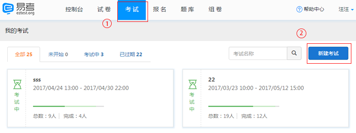
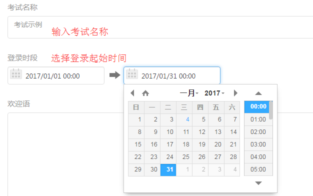
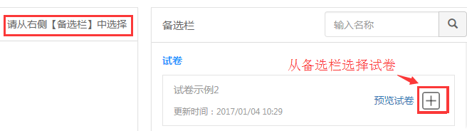
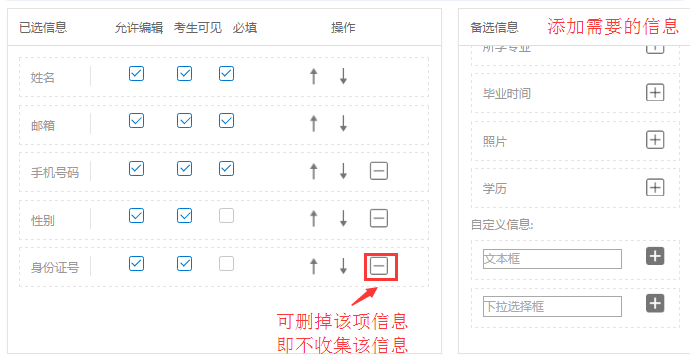
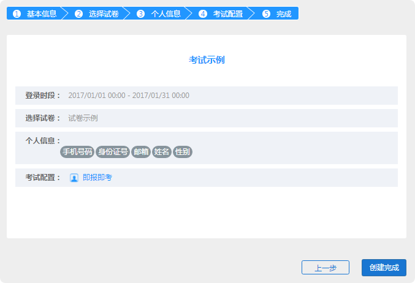
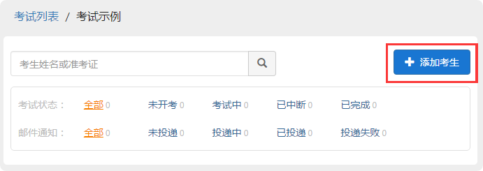
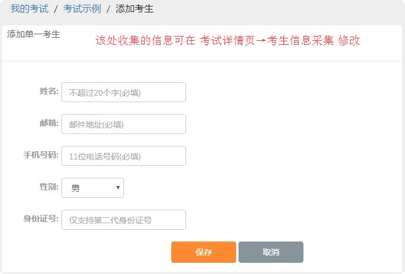
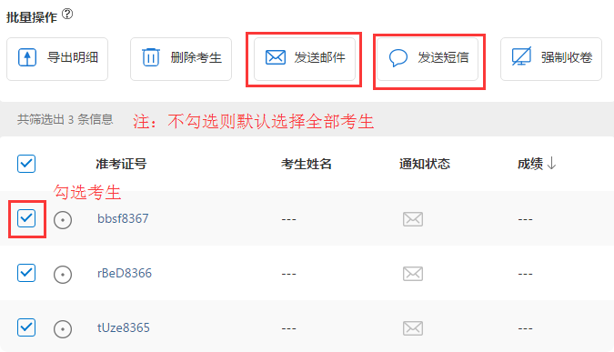
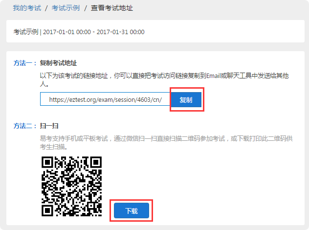

入门
=====

浏览器
--------

易考支持所有主流浏览器，不论是何种操作系统或设备，只要是支持HTML5标准的浏览器都可以正常使用。
为了更好的用户体验，我们建议使用如下浏览器：

电脑端：

1. Internet Explorer 9.0及以上版本
2. Chrome浏览器24.0及以上版本
3. Firefox（火狐浏览器）20.0及以上版本
4. Safari5及以上版本
5. Opera浏览器15及以上版本 

IOS移动终端：

1. Safari
2. Chrome
3. Firefox

安卓移动终端：

1. Google Chrome
2. Firefox

注：如果需要使用视频监控功能或者录音题，则必须使用如下浏览器：
电脑端：

1. Google Chrome
2. Firefox
3. Opera

安卓移动设备：

1. Google Chrome
2. Firefox

**注意：** iOS设备目前不支持视频监控功能和录音题，Internet Explorer的任何版本也不支持视频监考功能。很多国产浏览器使用和Google Chrome一样的内核，因此大部分情况下可以正常使用易考，但并不能支持视频监控功能和录音题。
  
我们推荐使用Chrome或者FireFox浏览器，并更新到最新版本，以便获得最佳的垮平台支持。

易考注册
---------

进入易考首页 https://eztest.org

点击“立即注册”（或右上角“注册”)

输入下列几项：

**1.设置您的用户名：**

**2.填写您的常用邮箱：** *您将会收到一封邮件激活您的易考账户*

**3.设置您的密码：**

**4.再次确认密码：** *两次输入的密码要一致*

注册后易考会发送一封验证邮件到您填写的邮箱，请点击邮件中的验证链接完成注册。

如果几分钟内没有收到邮件，请检查是否您的邮件客户端错把注册邮件归入垃圾邮件。

快速开始
----------

创建考试的步骤：

1. 点击导航栏“考试”，进入我的考试界面，点击右侧“新建考试”；

2. 按照步骤完成考试设置；

* 第一步：输入考试名称，设置登录时段，填写欢迎语（欢迎语可不填）；

* 第二步：选择此次考试所需要的试卷（需要先创建好试卷），从右边栏选择相应试卷点击“+”加入左边栏；

* 第三步：设置需要收集的考生个人信息；

* 第四步：设置考试配置（勾选需要的配置）；

.. _考试配置相关问题: http://docs.eztest.org/zh_CN/latest/exam.html#id13

	`考试配置相关问题`_

* 第五步：确认无误，创建完成。

3. 添加考生：考试详情页面点击“添加考生”，手工添加单个考生信息，保存即可。（必填项信息在考生信息采集中设置）

4. 易考可以通过邮件或短信帮您通知考生，在考试详情页面的批量操作中进行，勾选考生，发送邮件或短信。（不勾选任何考生则默认发送给所有考生）

5. 考试详情页面点击右下角“考试地址”详情，查看考试地址。考生只需要点击一个链接或扫描一个二维码，就可以进入考试，开始答题。

* 注：考生只需要考试地址的链接或二维码即可报名参加考试。

       如需要考生可以自主报名参加考试，在考试配置中勾选“即报即考”，

密码管理
------------

**忘记密码:**

1. 点击登录界面的“忘记密码？”，输入您的登录邮箱并确认。

2. 进入邮箱，您将收到一封重置密码的邮件，根据邮件内容点击链接重置账户密码即可。

**修改密码：**\
记得原密码并登录成功后，点击右上角用户名，选择子菜单修改密码，输入当前密码并设置新密码，提交即可更改密码。

控制台
--------

控制台的作用：

控制台直观展示了账户相关数据，分为三部分：

**1. 考试相关统计：**\该部分显示了考生人次、考试场次和试卷数的相关统计。

**2. 最近更新的试卷：**\该部分显示了账户最近更新的试卷。查看全部将转到我的试卷，可查看全部试卷。

**3. 今天的考试：**\该部分显示了账户今天有哪些考试（包括考试中和未开场），
查看全部将转到我的考试，可查看全部考试。

