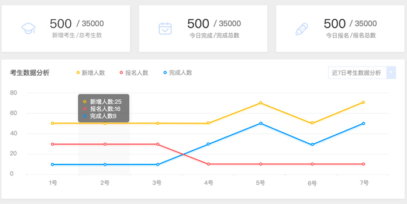
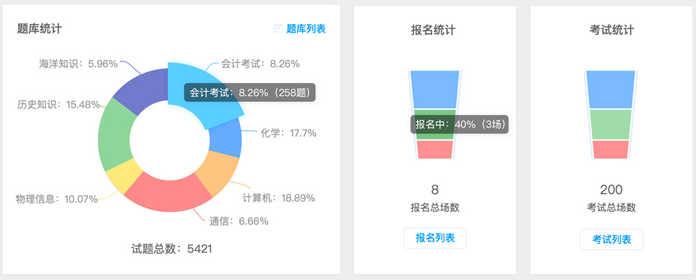
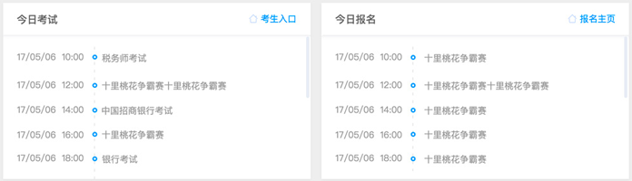
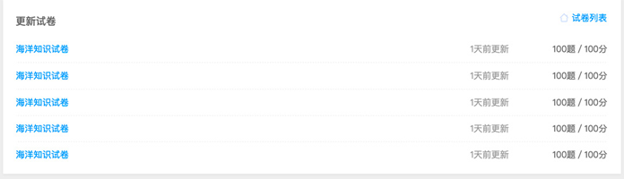
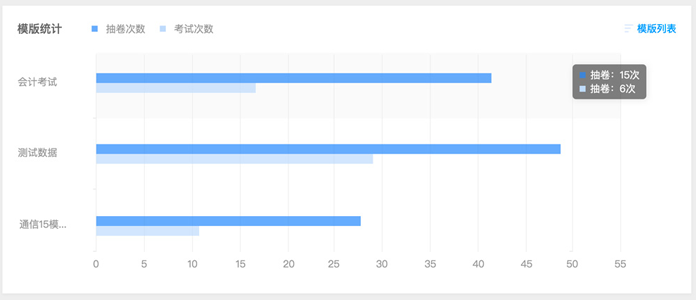

入门
=====

浏览器
--------

易考支持所有主流浏览器，不论是何种操作系统或设备，只要是支持HTML5标准的浏览器都可以正常使用。
为了更好的用户体验，我们建议使用如下浏览器：

电脑端：

1. Internet Explorer 9.0及以上版本
2. Chrome浏览器24.0及以上版本
3. Firefox（火狐浏览器）20.0及以上版本
4. Safari5及以上版本
5. Opera浏览器15及以上版本 

IOS移动终端：

1. Safari
2. Chrome
3. Firefox

安卓移动终端：

1. Google Chrome
2. Firefox

视频监控浏览器
```````````````````

**注意：若考试开启视频监控功能或者包含录音题，则必须使用如下浏览器：**

电脑端（包括Mac）：

1. Google Chrome
2. Firefox
3. Opera

安卓移动设备：

1. Google Chrome
2. Firefox

**注意：** iOS设备（iPhone和iPad）目前不支持视频监控功能和录音题；

Internet Explorer的任何版本也不支持视频监考功能。

很多国产浏览器大部分情况下可以正常使用易考，但不一定支持视频监控功能和录音题。
  
我们推荐使用Chrome或者FireFox浏览器，并更新到最新版本，以便获得最佳的跨平台支持。

易考注册
---------

进入易考首页 https://eztest.org

点击“立即注册”（或右上角“注册”)

输入下列几项：

**1.设置您的用户名：**

**2.填写您的常用邮箱：** *您将会收到一封邮件激活您的易考账户*

**3.设置您的密码：**

**4.再次确认密码：** *两次输入的密码要一致*

注册后易考会发送一封验证邮件到您填写的邮箱，请点击邮件中的验证链接完成注册。

如果几分钟内没有收到邮件，请检查是否您的邮件客户端错把注册邮件归入垃圾邮件。

快速开始
----------


创建考试的步骤：

1. 点击导航栏“考试”，进入我的考试界面，点击右侧“新建考试”；


2. 按照步骤完成考试设置；


* 第一步：输入考试名称，设置登录时段，填写欢迎语（欢迎语可不填）；


* 第二步：选择此次考试所需要的试卷（需要先创建好试卷），从右边栏选择相应试卷点击“+”加入左边栏；

.. image:: _static/1-4.png

* 第三步：设置需要收集的考生个人信息；


* 第四步：设置考试配置（勾选需要的配置）；

.. _考试配置相关问题: http://docs.eztest.org/zh_CN/latest/exam.html#id13

	`考试配置相关问题`_

* 第五步：确认无误，创建完成。


3. 添加考生：考试详情页面点击“添加考生”，手工添加单个考生信息，保存即可。（必填项信息在考生信息采集中设置）


4. 易考可以通过邮件或短信帮您通知考生，在考试详情页面的批量操作中进行，勾选考生，发送邮件或短信。（不勾选任何考生则默认发送给所有考生）


5. 考试详情页面点击右下角“考试地址”详情，查看考试地址。考生只需要点击一个链接或扫描一个二维码，就可以进入考试，开始答题。


* 注：考生只需要考试地址的链接或二维码即可报名参加考试。

       如需要考生可以自主报名参加考试，在考试配置中勾选“即报即考”，

密码管理
------------

**忘记密码:**

1. 点击登录界面的“忘记密码？”，输入您的登录邮箱并确认。

2. 进入邮箱，您将收到一封重置密码的邮件，根据邮件内容点击链接重置账户密码即可。

**修改密码：**\
记得原密码并登录成功后，点击右上角用户名，选择子菜单修改密码，输入当前密码并设置新密码，提交即可更改密码。

控制台
--------

控制台的作用：

控制台直观展示了账户相关数据，分为五部分：

**1. 考生人数相关统计**

该部分显示了三块数据：新增考生数/总考生数、今日完成考生人数/完成总数、今日报名人数/报名总数。

并对三部分数据进行折线图展示，可查看近7日/1月/1年的数据分析



**2. 题库/报名/考试三模块**

题库统计使用饼图展示账户中的各题库占比和试题数，可点击题库列表查看全部题库；

报名统计使用梯形图展示未开始/报名中/已结束的报名场次数，可点击报名列表查看全部报名；

考试统计使用梯形图展示未开始/考试中/已结束的考试场次数，可点击考试列表查看全部考试；



**3. 今日考试和报名**

今日考试展示了正在考试中的考试和开考时间，点击考生入口查看今日考试详细页；

今日报名展示了正在报名中的报名和开考时间，点击报名主页查看账户报名中的考试。



**4. 更新试卷**

该部分展示了近期更新的试卷，点击试卷列表查看账户全部试卷。



**5. 组卷模版统计**

该部分使用柱状图展示了组卷模版的使用情况，包含抽卷次数和考试次数，点击模版列表查看全部组卷模版。


