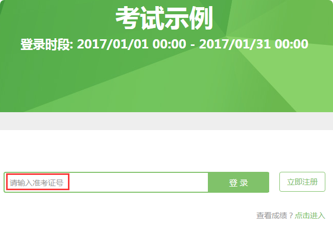
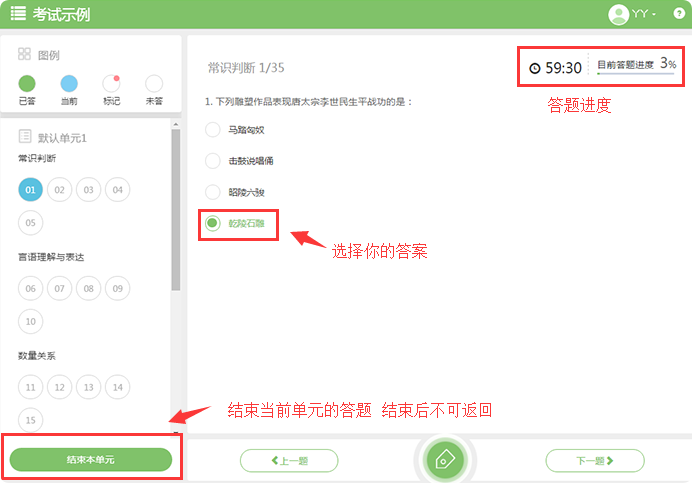
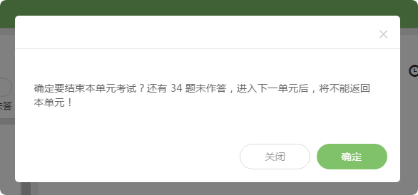
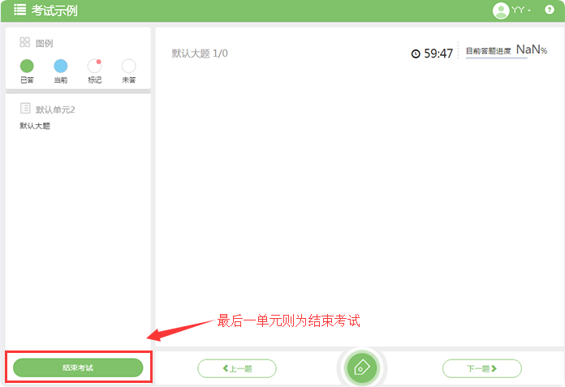
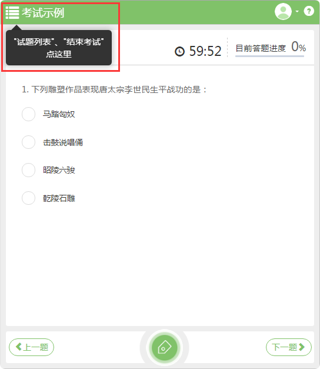
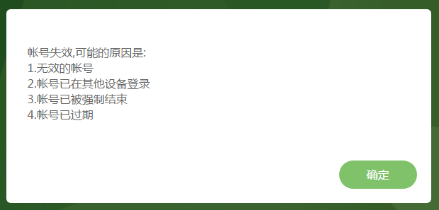
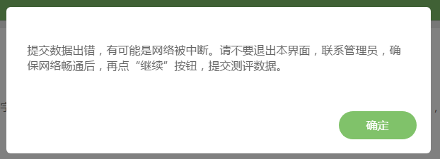

考生考试
=================

考试流程
----------

- **第一步：登录**

考生打开考试链接后，在登陆界面输入准考证号登录即可。（**注：在登录时段内才可以登录**）

可即报即考的考试，考生可点击立即注册进入考试：

- **第二步：填写信息**

确认或填写完整自己的基本信息；

- **第三步：答题&交卷**

点击开始考试，进入考试界面；

考试界面有显示考试计时，考完后点击左下角“结束考试”即可交卷。

若考试包含多个单元，需先结束当前单元后进入下一单元的答题（**注意：结束单元后不可在返回修改该单元答案，请考生确认无误后再结束**）

完成所有单元考试后，“结束考试”即可交卷。

**注：** 小屏设备（手机、Pad或缩小浏览器窗口）侧边图例和题号预览会自动收起，点击左上角考试示例即可出现；

查看成绩
--------------

对于考后可以查看成绩的考试，考生可在考完后查看成绩

.. image:: _static/4-25.png

若考后没有即刻查看成绩，可再次打开考试链接，在登录框右下方点击查看成绩。

.. image:: _static/4-26.png

考试相关问题
---------------

考生帐号失效：可能是被强制收卷/多处登陆

登录超过最大限制：设置登录次数的考试，登录超次后会提示

离开考试超次：离开考试页面超出设置的次数后会自动收卷

网络连接中断：

考试过程中网络断开连接可能出现题目显示不正常/无法交卷，断网后的答题记录无法保存，请考生一定要确保网络正常再进行考试。

网络断开一段时间后会弹框提示：

考生考试浏览器要求
--------------------

易考支持所有主流浏览器，不论是何种操作系统或设备，只要是支持HTML5标准的浏览器都可以正常使用。
为了更好的用户体验，我们建议使用如下浏览器：

电脑端（包括Mac）：

1. Internet Explorer 9.0及以上版本
2. Chrome浏览器24.0及以上版本
3. Firefox（火狐浏览器）20.0及以上版本
4. Safari5及以上版本
5. Opera浏览器15及以上版本 

IOS移动终端：

1. Safari
2. Chrome
3. Firefox

安卓移动终端：

1. Google Chrome
2. Firefox

注：如果需要使用视频监控功能或者录音题，则必须使用如下浏览器：
电脑端（包括Mac）：

1. Google Chrome
2. Firefox
3. Opera

安卓移动设备：

1. Google Chrome
2. Firefox

iOS移动终端：不支持

**注意：** iOS设备（iPhone和iPad）目前不支持视频监控功能和录音题，Internet Explorer的任何版本也不支持视频监考功能。很多国产浏览器使用和Google Chrome一样的内核，因此大部分情况下可以正常使用易考，但并不能支持视频监控功能和录音题。
  
我们推荐使用Chrome或者FireFox浏览器，并更新到最新版本，以便获得最佳的垮平台支持。