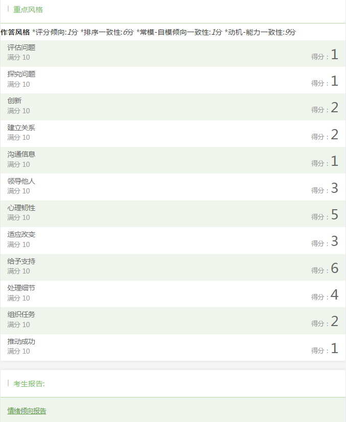
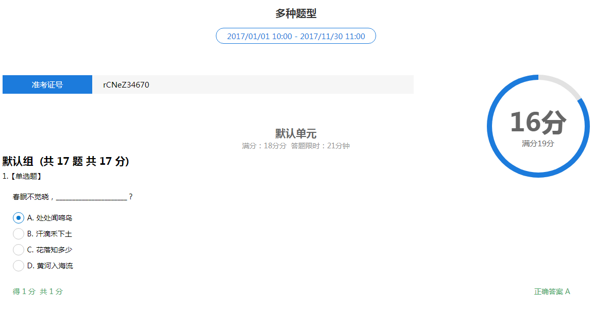
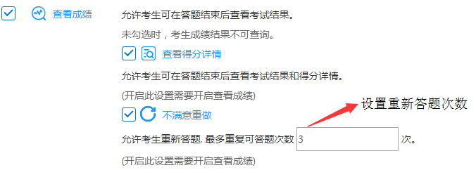
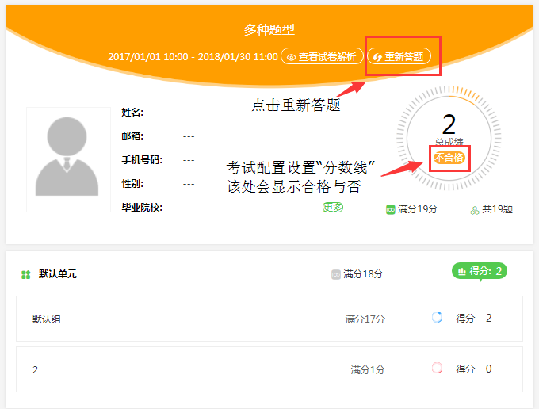
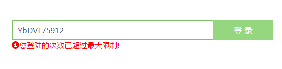
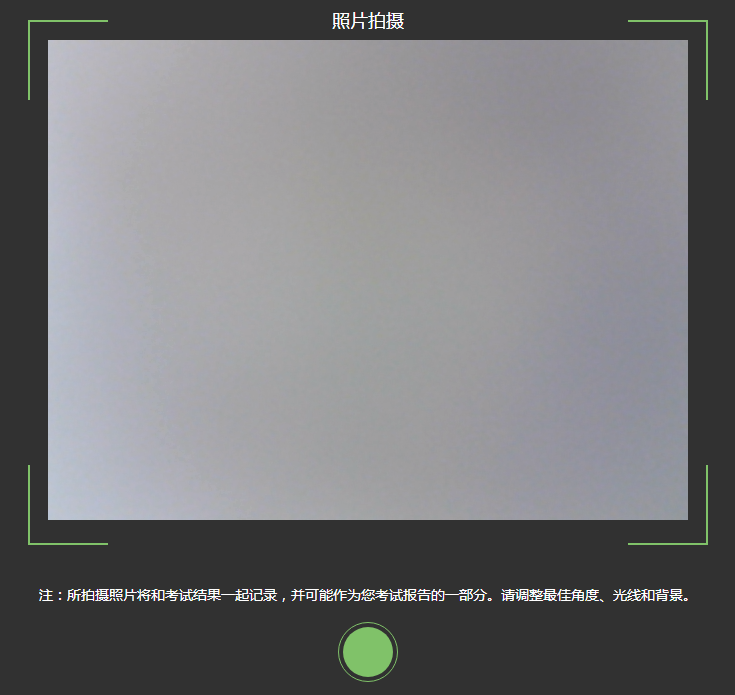
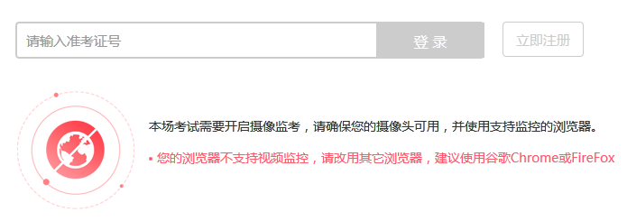

考生考试
=================

考试流程
----------

- **第一步：登录**

考生打开考试链接后，在登陆界面输入准考证号登录即可。（**注：在登录时段内才可以登录**）

可即报即考的考试，考生可点击立即注册进入考试：


- **第二步：填写信息**

确认或填写完整自己的基本信息；

- **第三步：答题&交卷**

点击开始考试，进入考试界面；


考试界面有显示考试计时，考完后点击左下角“结束考试”即可交卷。

若考试包含多个单元，需先结束当前单元后进入下一单元的答题（**注意：结束单元后不可在返回修改该单元答案，请考生确认无误后再结束**）


完成所有单元考试后，“结束考试”即可交卷。

.. image:: _static/8-4.png

**注：** 小屏设备（手机、Pad或缩小浏览器窗口）侧边图例和题号预览会自动收起，点击左上角考试示例即可出现；

.. image:: _static/8-5.png

查看成绩
-----------------

“查看成绩”这一配置项包括两个子配置项：

- 查看得分详情
- 不满意重做

要开启这两个子配置项必须要先开启“查看成绩”；

设置考场配置，勾选“查看成绩”，考生考完后可以自主查看成绩；对于配置了查看成绩的考试，考生考完后查看成绩的方法有两种：

1. 考试结束，在交卷后弹出的页面里直接点击查看成绩

.. image:: _static/4-25.png

2. 打开考试地址，右下角查看成绩，输入准考证号和姓名即可查看成绩。

.. image:: _static/4-26.png

包含个性测评的考试在考后查看成绩可查看测评各维度得分和报告链接（打开报告链接为完整的pdf报告）



查看得分详情
`````````````

勾选“查看成绩下”的“查看得分详情”，考生可在答题结束后查看考试结果和得分详情(开启此设置需要开启查看成绩)。

查看得分详情方法：

考试结束后进入查看成绩页面，点击查看试卷解析即可：

.. image:: _static/00-3.png



不满意重做
`````````````

考试配置开启“不满意重做”，则允许考生重新答题，可设置重做次数。



考生重新答题操作：考后查看成绩，点击“重新答题”按钮



**注：重新答题则只保留分数更高的作答结果（其余不做保存）**

考试相关问题
---------------

考生帐号失效：可能是被强制收卷/多处登陆

.. image:: _static/4-001.png

登录超过最大限制：设置登录次数的考试，登录超次后会提示



离开考试超次：离开考试页面超出设置的次数后会自动收卷

.. image:: _static/4-003.png

网络连接中断：

考试过程中网络断开连接可能出现题目显示不正常/无法交卷，断网后的答题记录无法保存，请考生一定要确保网络正常再进行考试。

网络断开一段时间后会弹框提示：


考生考试浏览器要求
--------------------

易考支持所有主流浏览器，不论是何种操作系统或设备，只要是支持HTML5标准的浏览器都可以正常使用。
为了更好的用户体验，我们建议使用如下浏览器：

电脑端（包括Mac）：

1. Internet Explorer 9.0及以上版本
2. Chrome浏览器24.0及以上版本
3. Firefox（火狐浏览器）20.0及以上版本
4. Safari5及以上版本
5. Opera浏览器15及以上版本 

IOS移动终端：

1. Safari
2. Chrome
3. Firefox

安卓移动终端：

1. Google Chrome
2. Firefox

含视频监控考试浏览器要求
--------------------------

**注意：若考试开启视频监控功能（或试卷含录音题），则对考生考试的浏览器和设备有一定要求。**

**浏览器要求：**

电脑端（包括Mac）：

1. Chrome
2. Firefox
3. Opera  

安卓移动设备：

1. Google Chrome
2. Firefox

iOS移动终端：需iOS11以上         

**注意：** iOS11以下（iPhone和iPad）目前不支持视频监控功能和录音题；

Internet Explorer的任何版本也不支持视频监考功能。

很多国产浏览器大部分情况下可以正常使用易考，但不一定支持视频监控功能和录音题。
  
我们推荐使用Chrome或者FireFox浏览器，并更新到最新版本，以便获得最佳的跨平台支持。

视频监控考时考生登录界面
````````````````````````````

当考生使用正确的浏览器和设备打开考试地址，界面如下：

.. image:: _static/0-0.png

点击“调试摄像头”测试本机摄像头是否可用，确认摄像头可用即可登录考试，拍照进入考试。

.. image:: _static/0-2.png

填写并确认个人信息后会进行登陆拍照：



当考生使用的浏览器不符合要求时，易考会提示您使用不符合要求的浏览器：（若使用iOS11以下版本的iOS设备，请注意更换设备。）

