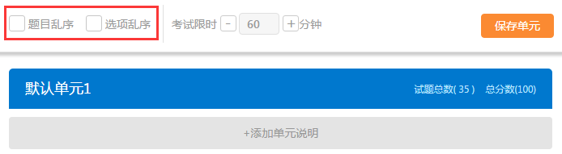
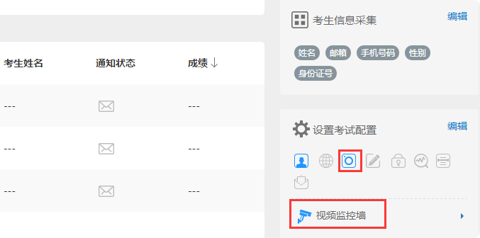

考试配置
============

易考有哪些考试配置？
----------------------

* 1.即报即考：考生可以自主报名参加考试

* 2.限定登录位置：限制考生登录考试的来源IP地址

* 3.视频监控：实时监控考生考试，并随即抓拍考生照片

    人脸验证：验证登录人和提供的照片是否一致

* 4.锁定考试：限制考生离开考试页面的次数

* 5.查看成绩：允许考生答题结束后查看成绩

    查看答卷：考生考后查看得分详情

    不满意重做：考生需要放弃前次答题成绩重新作答

* 6.分数线：设置考试通过的分数线

* 7.人工判分：试卷中有主观题需要配置人工判分

* 8.成绩通知：将该场考试的每个考生成绩通知以邮件发送给指定接收人

**注：** 其中，限定登录位置、视频监控、锁定考试能够有效防止考生作弊。

即报即考
``````````

在考试配置里勾选即报即考，则该场考试允许考生自主报名；

考生操作：考生只需打开考试地址，点击立即注册，填写完个人信息后会弹出一个窗口提示考生注册成功，点击确定直接进入考试。


**注：**\请记下您的登录账号（即为准考证号），若未直接进入考试，可再次打开考试地址使用登录账号登录。另外，查看成绩时也需要提供该登录帐号。


防作弊设置
------------

易考提供了试题乱序、选项乱序、限定登录位置、视频监控、锁定考试等防止作弊的措施。如果您觉得这些措施仍然不够，我们建议您在固定的教室内实施考试，并加派监考老师。

1.在试卷中设置：试题乱序、选项乱序



2.在考场配置中设置：限定登录位置、视频监控、锁定考试

.. image:: _static/4-16.png

限定登录位置
-------------

限定登录位置需在考试配置中勾选“限定登录位置”。

限定登录位置是依靠提供的一种防止考生作弊的方法，通过设置考试允许登录的IP地址，使考生只有在指定的网络环境下才可以参加考试，防止考场外人员替考的情况。

视频监控
---------

易考提供的视频监考功能可以实时捕捉考生摄像头的画面。在考试期间，您可以随时查看在线考生的实时视频。

易考并不记录完整的视频文件，因此，考试结束后不能回访考生的答题视频。但是，易考会拍摄考生登录时的照片，并随机抓拍考生在答题期间的照片。

在考试结束后，您仍然可以查看这些抓拍到的照片，作为判定考生是否有作弊行为的一个参考。

视频监控的开启：在考试配置里勾选视频监控即可。

**注意：若考试开启视频监控功能（或试卷含录音题），则对考生考试的浏览器和设备有一定要求。**

**浏览器要求：**

电脑端（包括Mac）：

1. Chrome
2. Firefox
3. Opera  

安卓移动设备：

1. Google Chrome
2. Firefox

iOS移动终端：需iOS11以上         

**注意：** iOS11以下（iPhone和iPad）目前不支持视频监控功能和录音题；

Internet Explorer的任何版本也不支持视频监考功能。
  
我们推荐使用Chrome或者FireFox浏览器，并更新到最新版本，以便获得最佳的跨平台支持。

视频监控考生界面:
``````````````````

当考生使用正确的浏览器和设备打开考试地址，界面如下：


点击“调试摄像头”测试本机摄像头是否可用，确认摄像头可用即可登录考试，拍照进入考试。


填写并确认个人信息后会进行登陆拍照：

.. image:: _static/0-3.png

当考生使用的浏览器不符合要求时，易考会提示您使用不符合要求的浏览器：（若使用iOS11以下版本的iOS设备，请注意更换设备。）

.. image:: _static/0-1.png

人脸验证
``````````

系统会在考生登录考试时校对其面部特征，并对结果进行记录。开启此设置需要报名时采集考生照片信息，并设置为必填，且创建考试时的照片信息项需设置为不允许考生编辑。

**注意：**\人脸验证为视频监控的下设验证方式，开启人脸验证时默认开启视频监控，因此对浏览器的要求和视频监控一致，同样也不可使用iOS系统的设备（iPhone、iPad）。


若考生登录时比对人脸和采集的考生照片匹配度低时会对考生进行提醒，考生可选择重拍或者忽略。


管理员可以在考试详情页里明确看到哪些考生的人脸匹配度低：


视频监控墙
```````````````

考试配置开启了视频监控的考试，可在考试详情页查看考生的视频监控界面。



进入视频监控墙可对监控墙界面进行如下调整：

1. 改变每行显示的考生监控画面数；
2. 刷新当前界面的考生，刷新后将换一批考生的监控画面；
3. 点击右下角退出视频监控墙


对单个考生可进行如下操作：

1. 点击上箭头将该考生的置顶，置顶后该考生将位于监控墙的第一个，点击刷新后，置顶的考生不会被刷新掉；
2. 点击叉号可关闭该考生，不看该考生的监控界面。


锁定考试
-----------

锁定考试即锁定考试界面，简称锁屏。开启锁屏功能需在考试配置里勾选“锁定考试”锁定考试。

锁屏的作用：限制考生离开考试界面，一旦超过规定次数便会终止考试自动交卷，对于防止考生作弊有一定作用；开启屏幕锁定考试时需要全屏操作，若离开考试界面后再次返回考试，请按照提示继续答题。

锁屏功能对于浏览器有一定的要求，若使用不支持全屏的浏览器不能进行考试，请使用以下浏览器：

1. Internet Explorer 11
2. Chrome浏览器24.0及以上版本
3. Firefox（火狐浏览器）20.0及以上版本
4. Internet Explorer 9、Internet Explorer 10可以非全屏使用，切屏视为离开考试

例如：一场考试中锁定考试并限制考生只能退出全屏5次，则退出第6次将自动交卷。每次退出全屏界面会有5秒倒计时，在5秒内返回全屏不计为退出全屏，若5秒内没有返回全屏将视为退出全屏1次，当离开考试第6次时会提示系统已自动交卷。


查看成绩
-----------------

“查看成绩”这一配置项包括两个子配置项：

- 查看得分详情
- 不满意重做

要开启这两个子配置项必须要先开启“查看成绩”；

设置考场配置，勾选“查看成绩”，考生考完后可以自主查看成绩；对于配置了查看成绩的考试，考生考完后查看成绩的方法有两种：

1. 考试结束，在交卷后弹出的页面里直接点击查看成绩

.. image:: _static/4-25.png

2. 打开考试地址，右下角查看成绩，输入准考证号和姓名即可查看成绩。

.. image:: _static/4-26.png

包含个性测评的考试在考后查看成绩可查看测评各维度得分和报告链接（打开报告链接为完整的pdf报告）

.. image:: _static/4-1-1.png

查看得分详情
`````````````

勾选“查看成绩下”的“查看得分详情”，考生可在答题结束后查看考试结果和得分详情(开启此设置需要开启查看成绩)。

查看得分详情方法：

考试结束后进入查看成绩页面，点击查看试卷解析即可：


.. image:: _static/4-006.png

不满意重做
`````````````

考试配置开启“不满意重做”，则允许考生重新答题，可设置重做次数。

.. image:: _static/00-1.png

考生重新答题操作：考后查看成绩，点击“重新答题”按钮

.. image:: _static/00-2.png

**注：重新答题则只保留分数更高的作答结果（其余不做保存）**

**成绩通知:**

**设置考后成绩通知：**\在设置考试配置时勾选成绩通知，填写上成绩通知接受者的邮件地址。 配置了成绩通知的考试，当考生完成考试后，邮件接受者将会收到该考生的成绩通知邮件。

