报名
===========

报名这一功能可将多科目多场考试集合在一场报名，便于考生自主选择科目进行报考，考试主办方方可自主选择报名考生。

创建报名
-------------------

报名流程图
````````````````

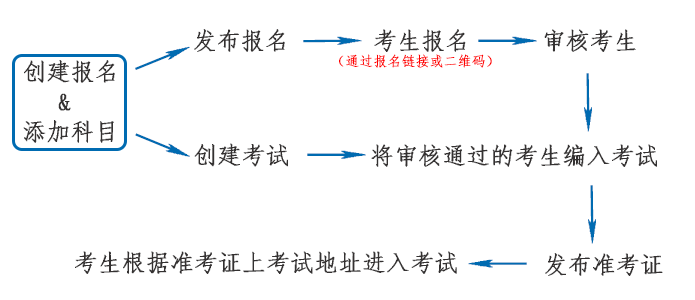

创建报名的步骤：
```````````````````

第一步：填写报名基本信息（不勾选开启报名审核的考试，默认所有报名考生通过审核）

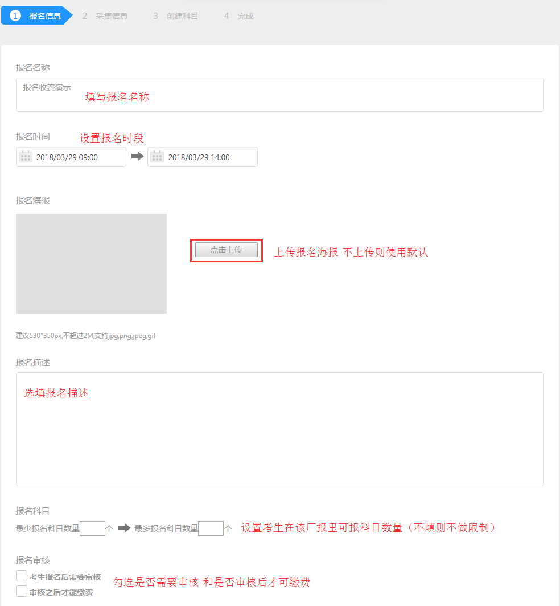

第二步：勾选需要采集的考生信息

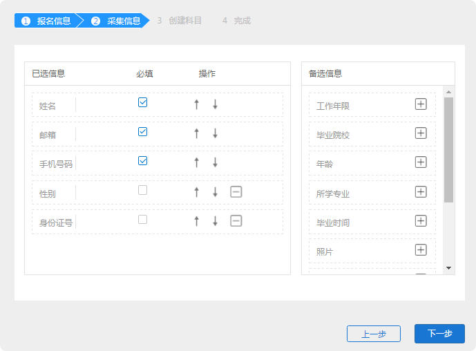

第三步：在报名详情页里的“科目管理”创建需要的科目

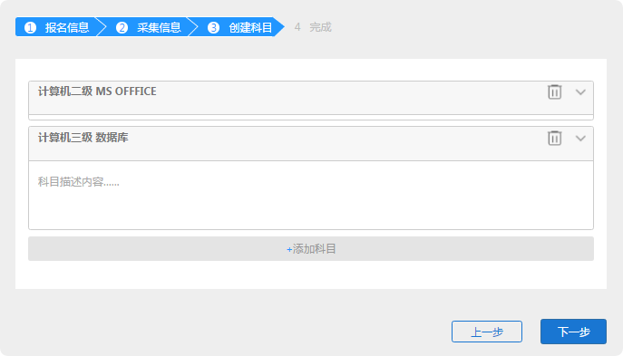

第四步：在报名详情页里的“考试管理”创建需要的考试

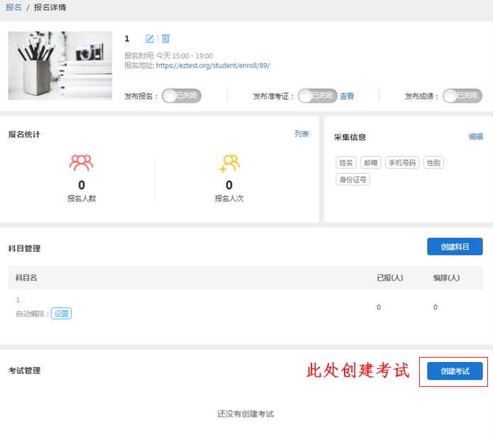

**注意：** 发布报名后，考生才可以打开报名链接进行报名

编排考生
----------------------

手动编排
````````````

编排考生即将考生编排到考试；

首先需要审核考生：

先在报名详情里查看报名列表，选择考生进行审核（创建报名未开启审核则默认通过）

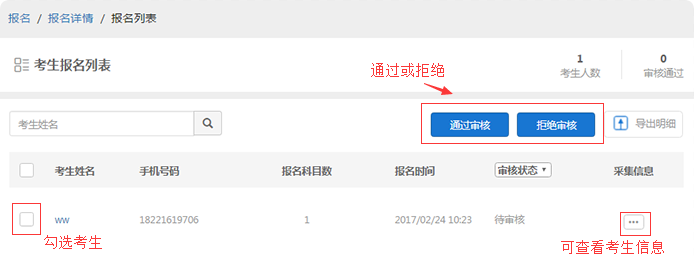

已通过审核的考生可以进行编排；

将考生编排到报名下的考试中，考生才能参加考试；

编排考生:打开报名下创建的考试，右侧选择从报名导入考生，选择考生编入考试即可；

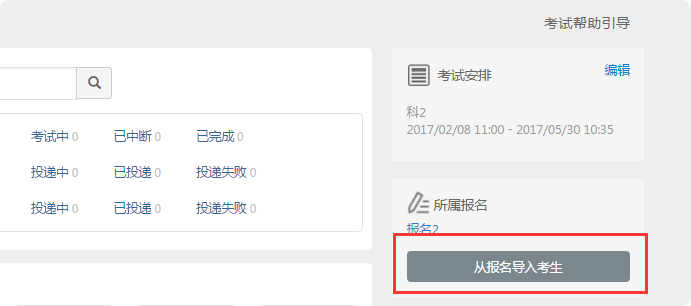

自动编排
``````````````

自动编排即将报名该科目的考生自动编排到对应考试里；

首先需要报名里已经创建考试；

设置自动编排：打开科目管理里‘自动编排’的设置；选择需要关联场次的考试，勾选下方选框保存即可。

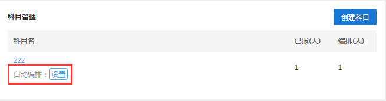

勾选“对该科目下已有考生”后，将对该科目下通过审核的所有考生进行编排（不需审核的默认通过），

不勾选则设置自动编排后的考生才会进行自动编排。

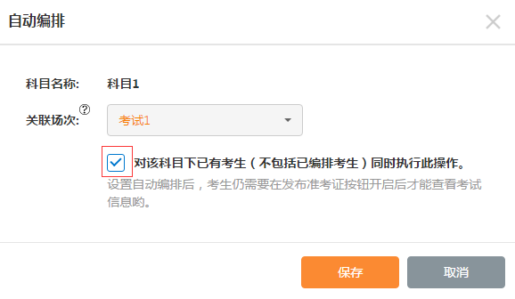

**注意：** 对于需要审核考生的报名，系统会在考生审核通过后进行自动编排。

开启自动编排后科目后会显示关联场次，取消后不会对已编排考生产生影响.


发布功能
-----------


- 发布报名：开启发布报名之后，考生即可通过报名地址打开该场报名进行报名（未发布则没有）。

- 发布准考证：发布准考证后已报名的考生即可在该场报名的报名科目里显示“开始考试”按钮（点击开始考试会有默认的准考证号，不可更改）。

- 发布成绩：开启发布成绩之后考生考后可在报名科目里查看成绩，未开启则不显示。

考生界面报名科目：

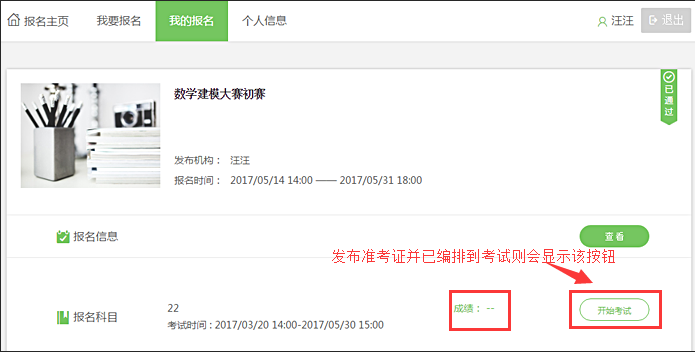

报名缴费
----------

注：报名缴费为增值业务，仅付费用户可以使用。

创建科目时可设置缴费：

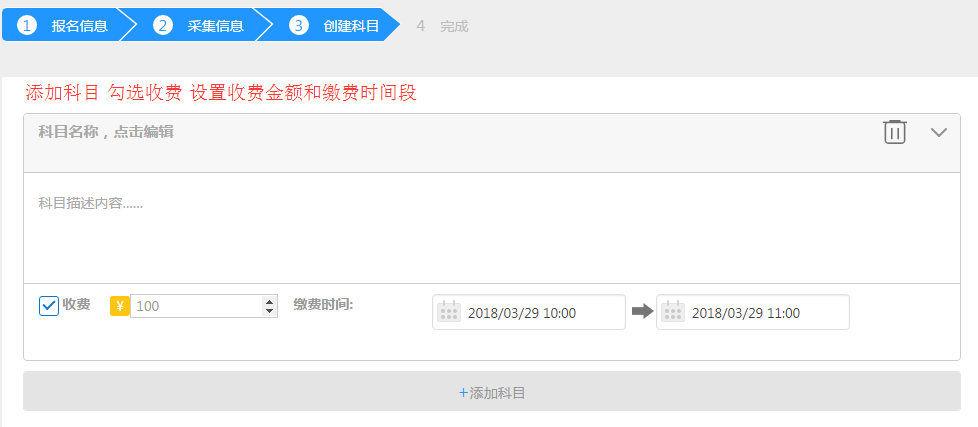

**考生退款**

步骤：报名统计——订单中心——点击订单编号——点击退款按钮即可

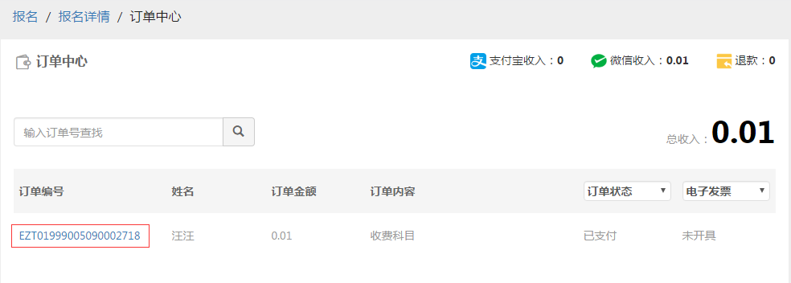

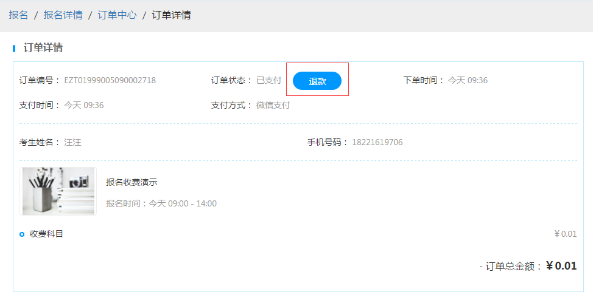

考生报名
-----------

* 通过考试主办方提供的报名地址链接或二维码进入该场报名；


* 点击我要报名，填写完成基本信息；

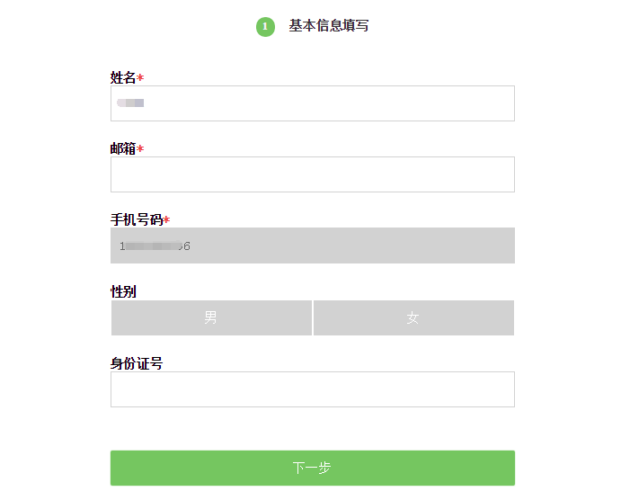

* 选择需要报名的的科目；

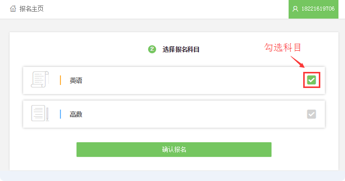

* 报名后可查看报名信息和科目详情：

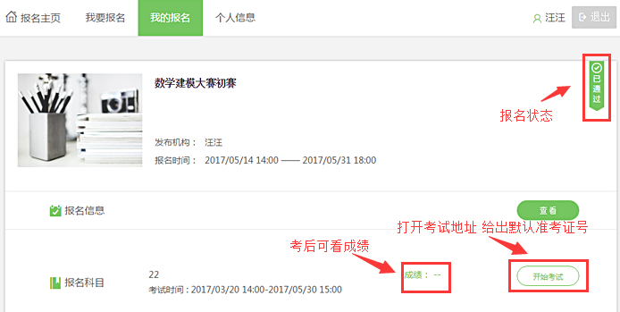

注：报名审核通过后，不可再重复进行报名；因此有多科目选择时，请注意确认是否选择正确。

考生报名注册
`````````````

考生报名需要进行注册，打开报名主页后，未注册的考生请先注册帐号，注册帐号可选择手机号码注册或邮箱注册。

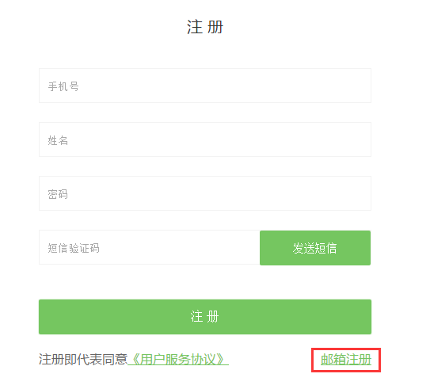