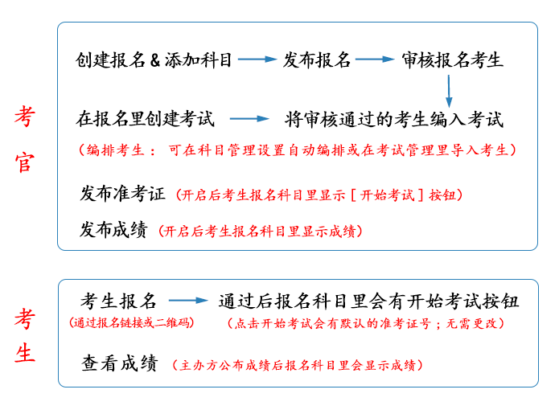

报名
===========

报名这一功能可将多科目多场考试集合在一场报名，便于考生自主选择科目进行报考，考试主办方方可自主选择报名考生。

报名考试流程图:
`````````````````````



创建报名的步骤：
`````````````````

第一步：填写报名基本信息（未勾选开启报名审核的考试，默认所有报名考生通过审核）


第二步：勾选需要采集的考生信息

.. image:: _static/11-2.png

第三步：在报名详情页里的“科目管理”创建需要的科目

.. image:: _static/11-3.png

第四步：在报名详情页里的“考试管理”创建需要的考试


**注意：** 发布报名后，考生才可以打开考试地址链接进行报名

将考生编排到考试
----------------------

首先需要审核考生：

先在报名详情里查看报名列表，选择考生进行审核（创建报名未开启审核则默认通过）

.. image:: _static/11-10.png

已通过审核的考生可以进行编排；

将考生编排到报名下的考试中，考生才能参加考试；

编排考生:打开报名下创建的考试，右侧选择从报名导入考生，选择考生编入考试即可；


发布功能
-----------


- 发布报名：开启发布报名之后，考生即可通过报名地址打开该场报名进行报名（未发布则没有）。

- 发布准考证：发布准考证后已报名该场考试的考生即可查看个人准考准，准考证包含有该场报名的考试地址。

- 发布成绩：开启发布成绩之后考生考后可知道自己的成绩，未开启则不显示。

考生报名
-----------

* 通过考试主办方提供的报名地址链接或二维码进入该场报名；


* 点击我要报名，填写完成基本信息；

.. image:: _static/11-7.png

* 选择需要报名的的科目；

.. image:: _static/11-8.png

注：报名审核通过后，不可再重复进行报名；因此有多科目选择时，请注意确认是否选择正确。
