考试
=======

考试安排
----------

如何创建考试？
````````````````

点击新建考试，易考会提供一个向导来帮助您完成考试设置。

1. 填写考试基本信息

2. 选择该场考试所需试卷

3. 设置需要考生填写的个人信息

4. 设置所需考场配置即可完成创建；

**注：** 对于已创建的考试，依然可以随时更改以上所有设置。但要注意不要影响已经参加考试的考生。

**应当如何设定和更改考试登录时段？**

考试登录时段是指允许考生登录考试的起止时间段。

在此时间段内，新考生可以登录开始考试，中断考试的考生也可以重新登录继续考试。
超过此时间段后，除了正在考试的考生，其他考生不能登录开始或继续考试。

超过登录时段后，对于正在考试的考生无影响，仍然可以正常答题，直到试卷限定的时间用完后才会被自动交卷。

管理员可以在后台随时强制结束考生考试，也可以随时调整考试登录时间。即使在考试登录时间已经超过后，管理员仍然可以修改考试登录时间。

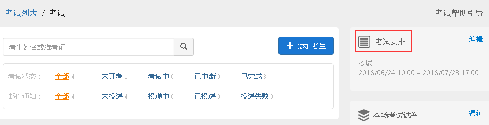

如何提前或延后开考时间？
````````````````````````````

更改考试登录时段的起始时间即可改变开考时间。

调整考试登录时段的作用：

提前开始考试：将登录时段的起始时间提前，即提前考生开考时间。

提前结束登录：将登录时段的截止时间提前，未登录的考生在截止时间之后不能进入考试。

延后开考时间：将登录时段的起始时间延后，即延后考生开考时间。

延后结束登录：将登录时间的截止时间延后，可延长考生登录的时间。

可以提前结束考试或延迟考试吗？
`````````````````````````````````

一. 提前结束考试的方法：

1. 强制收卷，可以提前结束考生考试

.. image:: _static/image035.png

2. 缩短本场考试试卷的限制时间， 可使考生的考试时间缩短，达到提前结束考试的目的。但修改试卷限时只能影响之后登录的考生，已经开考的考生不受影响。

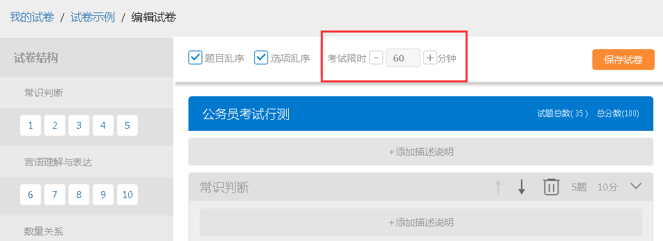

二. 延迟考试的方法：

1. 增加本场考试试卷的考试限时，可使考生考试时间增加，达到延迟考试的目的。同样，此设置只影响之后登录的考生，已经开考的考生不受影响。

试卷设置
----------

考试过程中修改或更换试卷
`````````````````````````````````

即使已经有考生正在考试，也可以修改试卷或者更换试卷。但是，调整过的试卷只影响后续登录的考生。已经在考试的考生仍然会使用其第一次登录时的试卷不变，即使重新登录也不会更新试卷。

AB卷或多份试卷
````````````````````````````````

一场考试可以设置一份或多份试卷。
当指定多份试卷后，易考会在每个考生登录时随机为其选择一份试卷。

在创建考试时可以选择两份或多份试卷，需要注意所选的试卷结构必须一致。

试卷结构一致的要求：试卷的考试限时、试卷单元名称、大题名称、每道大题包含小题的题型和题数、和每道小题的分数都完全一致。

随机抽题，一人一卷
`````````````````````````````````

随机抽题即一场考试中的考生随机抽取到不同的试题，但试卷的结构和分数保持一致。可有效避免考生作弊。

实现一人一卷的方法：

需要提前准备好题库，并在组卷模块中创建好组卷模板。
考试安排中，选择使用模板作为考试试卷，每个考生登录时依照规则动态组卷，实现一人一卷。

**注：**\使用模版抽卷需要设置好抽题规则，以免导致抽卷失败；特别是所选题库中的复合题要保证小题类型和数量的一致。

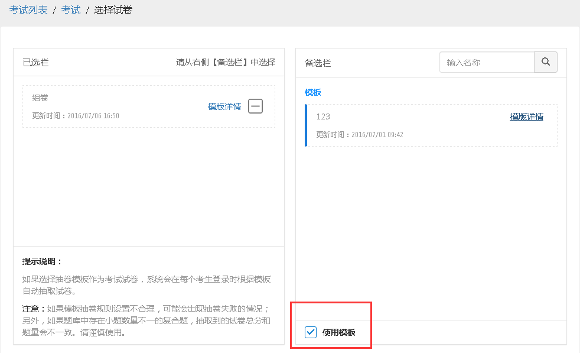


准考证
------------


易考会自动为添加的考生生成准考证号，自动生成的准考证号由8位随机生成的字母和数字组合而成。
我们推荐用户使用易考自动生成的准考证号，这样可以最大程度避免考试帐号被盗用的情况。

但是，如果确实需要使用自定义的准考证号，例如：身份证号、电话号码、学号等，可以采用如下方法：

1.考试详情页面点击添加考生，在右侧“批量导入考生”下载导入考生模板;

2.在模板Excel表格中手工添加一列，名称为：准考证号。按照模版填写考生各项信息，在准考证号一列填写自定义的准考证号。

**注：**\自定义准考证号只能使用字母、数字、下划线和减号，不允许使用其他特殊字符。

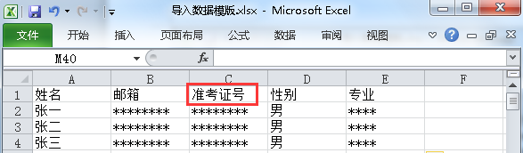


考生信息采集
-------------

易考提供的可选考生信息有：姓名、邮箱、手机号码、性别、身份证号、毕业院校、年龄、所学专业、工作年限、照片、学历；

以上所有信息项均可设置是否允许学生编辑、是否为必填项。

如果学校、企业或机构需要收集考生的其他信息（比如班级、应聘职位等等），可以在创建考试时增加自定义字段。

**操作方法：**创建考试时，在第3步将个人信息的备选信息栏拉到底部，在自定义信息框填写您所需要的考生信息，然后加入即可。

.. image:: _static/image025.png

对于已经存在的考试：编辑考生信息采集，然后加入自定义信息。

.. image:: _static/image027.png


考试配置
---------

易考有哪些考试配置？
````````````````````

1.即报即考：考生可以自主报名参加考试

2.限定登录位置：限制考生登录考试的来源IP地址

3.视频监控：实时监控考生考试，并随即抓拍考生照片

4.锁定考试：限制考生离开考试页面的次数

5.查看成绩：允许考生答题结束后查看成绩

6.分数线：设置考试通过的分数线

7.人工判分：试卷中有主观题需要配置人工判分

8.成绩通知：将该场考试的每个考生成绩通知以邮件发送给指定接收人

**注：** 其中，限定登录位置、视频监控、锁定考试能够有效防止考生作弊。

防作弊设置
````````````

易考提供了试题乱序、选项乱序、限定登录位置、视频监控、锁定考试等防止作弊的措施。如果您觉得这些措施仍然不够，我们建议您在固定的教室内实施考试，并加派监考老师。

1.在试卷中设置：试题乱序、选项乱序

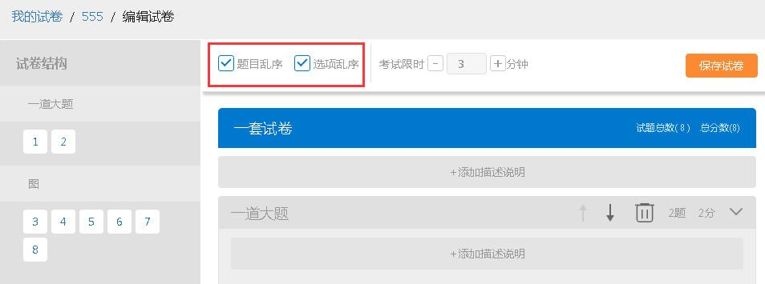

2.在考场配置中设置：限定登录位置、视频监控、锁定考试

.. image:: _static/image041.png

**限定登录位置:**

限定登录位置需在考试配置中勾选“限定登录位置”。

限定登录位置是依靠提供的一种防止考生作弊的方法，通过设置考试允许登录的IP地址，使考生只有在指定的网络环境下才可以参加考试，防止考场外人员替考的情况。

**视频监控:**

易考提供的视频监考功能可以实时捕捉考生摄像头的画面。在考试期间，您可以随时查看在线考生的实时视频。易考并不记录完整的视频文件，因此，考试结束后不能回访考生的答题视频。但是，易考会随机抓拍所有考生在答题期间的照片，因此，在考试结束后，您仍然可以查看这些抓拍到的照片，作为判定考生是否有作弊行为的一个参考。

视频监控的开启：在考试配置里勾选视频监控即可。

视频监控需要考生使用如下浏览器：

电脑端：

1. Google Chrome
2. Firefox
3. Opera

安卓移动设备：

1. Google Chrome

**注意：**\iOS设备不支持视频监考功能，Internet Explorer的任何版本也不支持视频监控功能。

**视频监控墙:**

考试配置开启了视频监控的考试，可在考试详情页查看考生的视频监控界面。

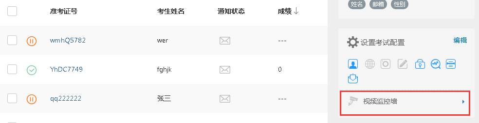

进入视频监控墙可对监控墙界面进行如下调整：

1. 改变每行显示的考生监控画面数；
2. 刷新当前界面的考生，刷新后将换一批考生的监控画面；
3. 点击右下角退出视频监控墙

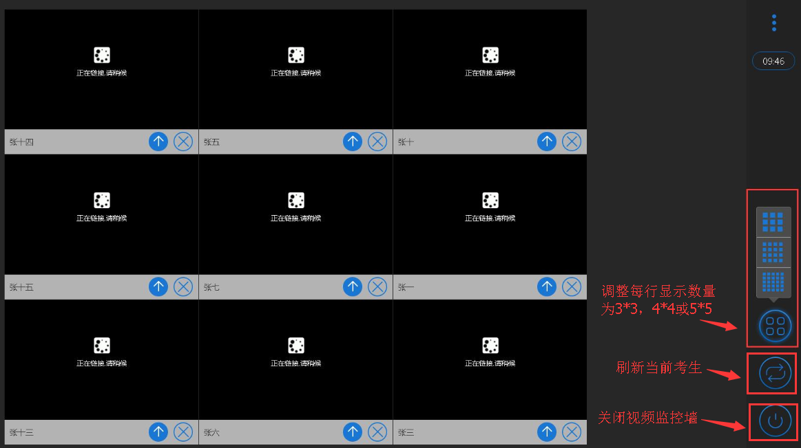

对单个考生可进行如下操作：

1. 点击上箭头将该考生的置顶，置顶后该考生将位于监控墙的第一个，点击刷新后，置顶的考生不会被刷新掉；
2. 点击叉号可关闭该考生，不看该考生的监控界面。

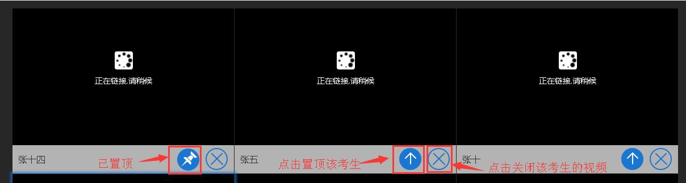

**锁定考试:**

锁定考试即锁定考试界面，简称锁屏。开启锁屏功能需在考试配置里勾选“锁定考试”锁定考试。

锁屏的作用：限制考生离开考试界面，一旦超过规定次数便会终止考试自动交卷，对于防止考生作弊有一定作用；开启屏幕锁定考试时需要全屏操作，若离开考试界面后再次返回考试，请按照提示继续答题。

锁屏功能对于浏览器有一定的要求，若使用不支持全屏的浏览器不能进行考试，请使用以下浏览器：

1. Internet Explorer 11
2. Chrome浏览器24.0及以上版本
3. Firefox（火狐浏览器）20.0及以上版本
4. Internet Explorer 9、Internet Explorer 10可以非全屏使用，切屏视为离开考试

例如：一场考试中锁定考试并限制考生只能退出全屏5次，则退出第6次将自动交卷。每次退出全屏界面会有5秒倒计时，在5秒内返回全屏不计为退出全屏，若5秒内没有返回全屏将视为退出全屏1次，当离开考试第6次时会提示系统已自动交卷。


其他考试配置
``````````````

**即报即考:**
\在考试配置里勾选即报即考，则该场考试允许考生自主报名；

考生操作：考生只需打开考试地址，点击立即注册，填写完个人信息后会弹出一个窗口提示考生注册成功，点击确定直接进入考试。


**注：**\请记下您的登录账号（即为准考证号），若未直接进入考试，可再次打开考试地址使用登录账号登录。另外，查看成绩时也需要提供该登录帐号。

.. image:: _static/image052.png

**查看成绩:**

设置考场配置，勾选“查看成绩”，考生考完后可以自主查看成绩；对于配置了查看成绩的考试，考生考完后查看成绩的方法有两种：

1. 考试结束，在交卷后弹出的页面里直接点击查看成绩

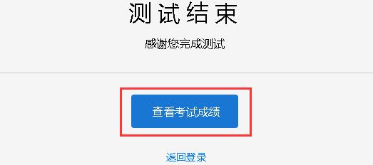

2. 打开考试地址，右下角查看成绩，输入准考证号和姓名即可查看成绩。

.. image:: _static/image055.png

**成绩通知:**

**设置考后成绩通知：**\在设置考试配置时勾选成绩通知，填写上成绩通知接受者的邮件地址。 配置了成绩通知的考试，当考生完成考试后，邮件接受者将会收到该考生的成绩通知邮件。

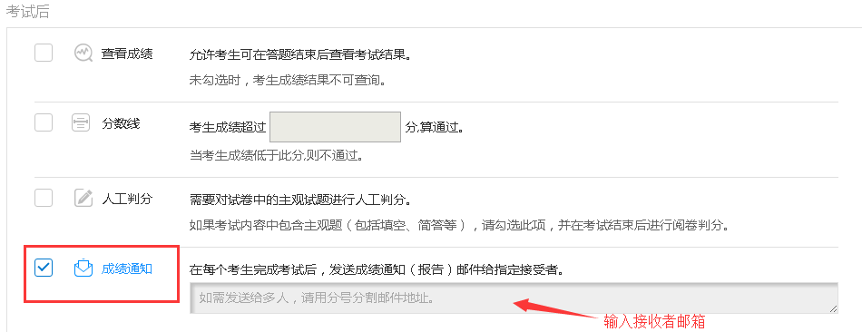

考试地址
--------

考生参加考试方法:

易考里的每场考试都有一个独立的链接地址。
考官可通过邮件、短信或其他任何方式将此链接发送给考生。考生只需要点击一个链接或扫描一个二维码，就可以开始答题。

将考试相关信息发送给考生:

1. 考试详情页面，勾选需要的考生执行批量操作，可选择发送邮件或发送短信。（若不勾选，则对所有考试执行操作） 

.. image:: _static/image013.png

2. 打开考试地址详情，右侧发送邮件给所有考生或指定收件人。

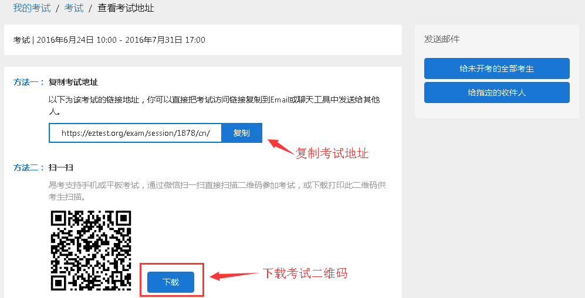

批量操作
--------

批量操作可以选择部分考生或所有考生进行以下操作：\**导出明细、删除考生、发送邮件、发送短信、强制收卷**\。

对所有考生批量操作的方法如下:

1. 直接勾选所有考生，即可对所有考生执行批量操作;

2. 不勾选任何考生，默认对所有考生执行操作。

人工阅卷
----------

对于一些没有固定答案的试题，需要对考试配置人工阅卷，在考生结束考试后由阅卷老师来进行判分。

人工阅卷支持的题型有：简答题、填空题、录音题（包括复合题中的简答、填空、录音题）。

**如何让多名判分老师分担人工阅卷工作？**

若一场考试结束后需要多名老师进行人工判分，易考建议您使用以下方法：

打开考试详情页，选择导出明细，下载考生明细表，打开该表可以看见每个考生会有一个判分连接，分发给不同的老师即可。

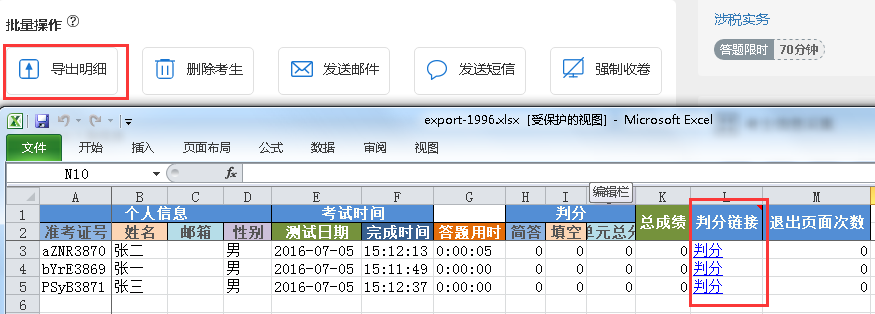

分析报告
---------

考试分析报告有什么用途？如何获取分析报告？
```````````````````````````````````````````

考试分析报告：对该场考试的答题情况、试卷情况和考生情况的信息统计。

考试分析报告的作用：

1.统计考试人数、完成人数、未完成人数以及缺考人数；

2.统计考试中每套试卷的使用率；

3.分析每套试卷的答题时长；

4.统计考生的得分分布状态；

5.对使用的每套试卷进行分析，给出每道试题的正确率、选择项分布率、平均答题时间、平均得分等统计结果。

**考试报告获取方法：** 打开考试详情页面，查看考试报告即可。

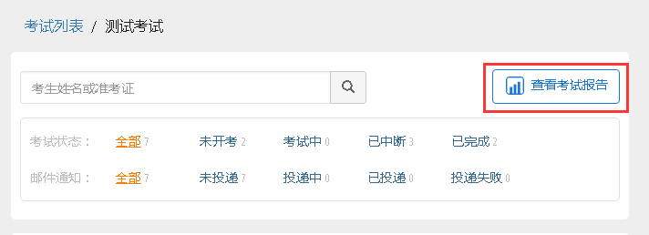

**试题解析获取方法：** 查看考试报告，下拉找到试卷分析，点击右侧试题解析即可查看该套试卷的试题分析。

.. image:: _static/shiti.png

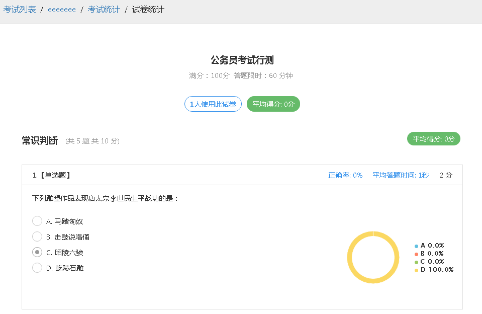

**注意：** 已结束的考试才可以生成考试报告，若考试登录时间还未过期，更改登录结束时间，变为已过期的考试即可生成考试报告。

测评类考试结束后，为什么有些考生没有生成考生报告？
``````````````````````````````````````````````````````````

个性测评类考试会为每个考生生成一份测评报告（例如Saville测评），需要考生完整的完成所有问卷问题，如果考生没有全部完成，就不能正常的生成测评报告。

**注：** 若考生被强制收卷也不能正常生成考试报告。

