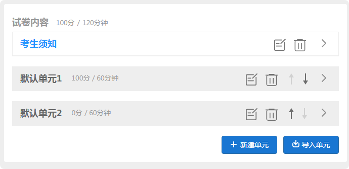
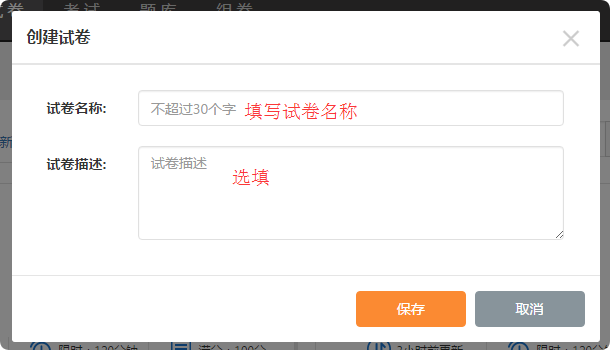
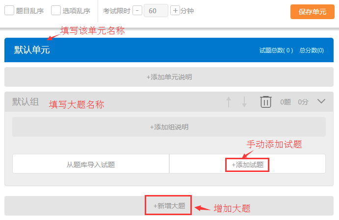
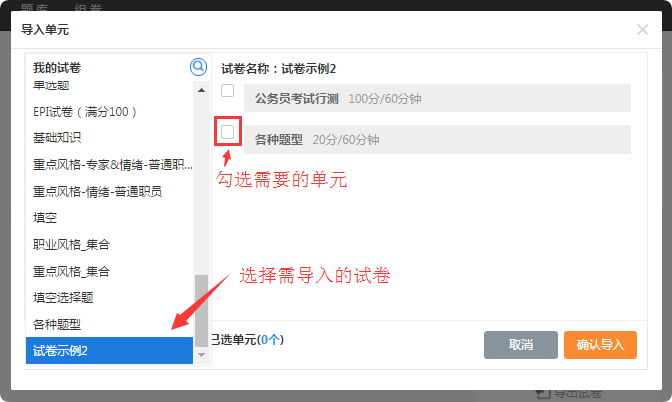
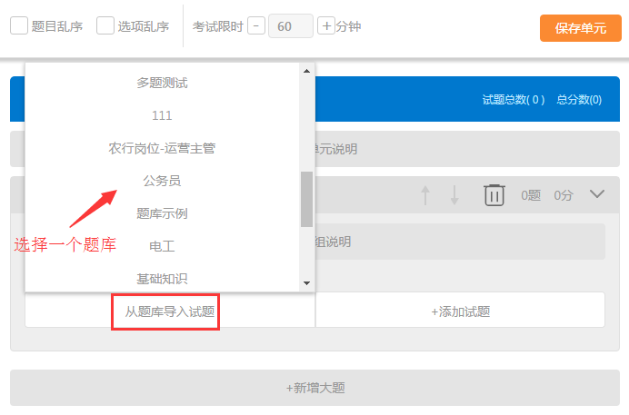
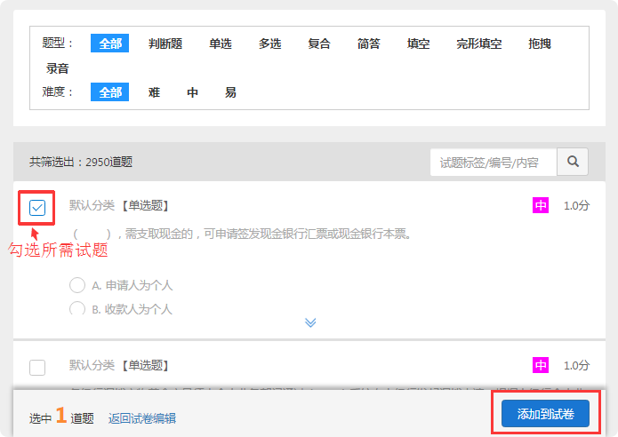
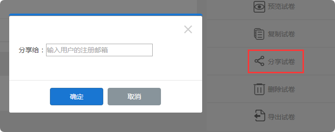

试卷
=======

题型
-------

易考支持的题型：

* 1. 判断题

* 2. 单选题

* 3. 多选题

* 4. 复合题（即综合分析题）

* 5. 简答题

* 6. 填空题

* 7. 录音题

* 8. 拖拽题

* 9. 完形填空题

**注：**\所有类型的试题均支持上传音频和图片。

其中简答、填空和录音题需要人工判分；判断、单选和多选题必须设置正确答案；

复合题增加下设小题请点击“+新增子试题”并选择需要的题型。

.. _各种题型展示: http://docs.eztest.org/zh_CN/latest/items.html#id2

	`各种题型展示`_

试卷结构
------------

一份普通试卷可包含多个单元，单元可以设置限时，超过时间自动结束该单元。



每个单元可以包含一个或多个大题，每个大题可以包含多个试题。试题中的复合题可以包含多个小题，填空题的每一个填空项也视为一个小题。

若需要在一场考试中配置多份试卷，则需要所选试卷的结构一致。

试卷结构一致的要求：考试限时、试卷单元名称、大题名称、每道大题包含小题的题型和题数、和每道小题的分数都完全相同。


试卷编辑
----------

如何创建试卷？
```````````````

1. 点击导航栏“试卷”，进入我的试卷界面；

2. 点击“+新建试卷”，在弹出的“创建试卷”窗口输入试卷名称和试卷描述（可不输入试卷描述）。



3. 此时将会出现一个默认单元，编辑该单元并保存试卷即可




**编辑试卷的具体步骤：**

* 填写单元名称（若需要描述说明可添加描述说明，该描述说明会在考生进入考试答题之前提醒）

* 填写大题名称（若需要对该大题进行说明可添加描述说明）

* 添加试题（即为该大题下的小题，有多种类型题供选择）

* 若需要在增加大题点击下方“+新增大题”即可。

* 编辑完成点击右上角“保存试卷”

* 复合题增加下设小题请点击“+新增子试题”。

4. **试卷添加多单元：** 若需要一份试卷添加多个单元可在编辑试卷界面新建单元或导入单元（导入单元可选择已有试卷的单元）




5. 试卷可添加考试描述，考生须知会在考生登录考试答题之前显示，考生可阅读完考生须之后，点击开始答题

.. image:: _static/2-7.png


高级编辑的作用？
````````````````````

高级编辑在编辑题干、选项、答案、解析时可以使用，点击编辑框右上角“高级编辑”符号即可进入高级编辑。
高级编辑的作用有：

* 1. 使用高级编辑对一段文字进行调整排版更简便。

* 2. 在高级编辑中粘贴一段文字会保留原段落格式；若直接在编辑框粘贴则会失去原段落格式。

* 3. 在高级编辑中，可以调整和改变插入图片的尺寸。

* 4. 高级编辑中可以使用源代码。

插入图片到试题:

* 1. 编辑试题时，在编辑框的右上角点“上传图片”按钮，选择需要的图片上传到试题即可。

* 2. 如需更改图片尺寸，进入高级编辑，选中该图片拉伸来放大（或缩小）图片，或点击“编辑图片”按钮自定义图片尺寸。

从题库导入试题
-----------------------

如果已经建立了题库，可以在试卷编辑时从题库导入试题到试卷:

首先要保证账户创建了题库并录入了试题，在试卷编辑时可选择从题库导入试题。步骤如下：

* 1. 进入编辑试卷界面，点击下方按钮“从题库导入试题”，选择需要的题库；



* 2. 在题库里勾选所需要的试题，点击右下角“添加到试卷”即可。



**注：** 根据题型、难度等条件来筛选需要的试题可以缩小搜索范围；
也可通过试题标签/编号/内容来搜索所需试题。
如果选错题库或者不需要选择试题，点击下方“返回试卷编辑”即可回到之前编辑试卷的界面。


试卷分享
-----------

试卷分享是将一份试卷给其他账户使用的便捷方式；可以将我的账号下面的试卷分享到别人账号下。 

**方法：** 在我的试卷里选择一份试卷，选择分享，填写对方用户的注册邮箱，确认分享后此用户便可以拥有该套试卷。

