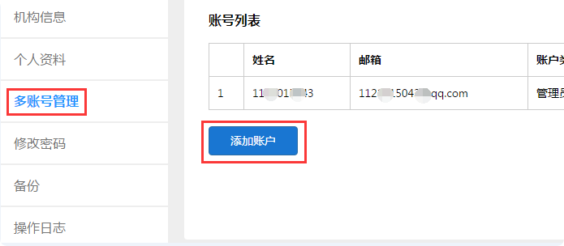
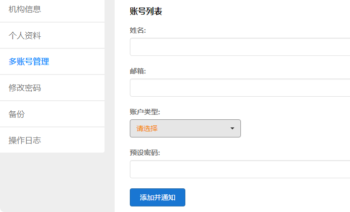

多账户管理
===========

易考主账户（在易考注册登录的账户）下可添加多个账号，即为子账户；

子账户仅可作为该主账户的分支使用，被删除后账号便不再存在；

为了方便分配主账户下的相关工作，子账户只有部分功能可使用，不同角色功能不同；

现子账户有多个角色可选：

* 人工判分员
* 内容制作员
* 考试观察员
* 管理员
* 考试管理员

添加子账户
-------------

添加多账号的步骤如下：

* 通过右上角用户名下拉菜单进入管理中心，选择多账号管理；

* 填写帐号信息：姓名、邮箱（不可为易考已有账户）；

* 选择账户类型；

* 设置该账户的预设密码；

添加并通知后会有一封激活邮件发送到上面填写的邮箱中，激活后即可使用。





子账户各角色简介
----------------------

管理员
`````````

首先，主账户的默认角色即为管理员；

管理员拥有最高权限，可使用易考所有可见功能，可对子账户进行管理；

子账户也可添加管理员，可行使主账户所有权力。

人工判分员
````````````

作用：对考生答卷上的主观题进行判分

可操作：查看账户中的考试、阅卷判分

不可操作：修改试相关设置、查看考生信息

 `点击查看人工判分相关帮助`_

.. _点击查看人工判分相关帮助: http://docs.eztest.org/zh_CN/latest/score.html

内容制作员
```````````````

作用：制题，编辑试卷，创建题库和组卷

可操作：创建和修改删除试卷/题库；创建和修改组卷模版；组卷抽取试卷；分享试卷。

不可操作：查看和修改考试相关内容

考试管理员
`````````````

作用：安排组织考试

可操作：查看和修改试卷；查看考生信息；查看试卷；查看组卷模版。

不可操作：编辑试卷、题库和组卷

考试观察员
`````````````````

作用：查看考试中的视频监控

可操作：查看账户中的考试；进入视频监控墙查看考生视频监控；查看考生（可选择单个考生查看视频监控）

不可操作：修改考生相关设置

 `点击视频监控相关帮助`_

.. _点击视频监控相关帮助: http://docs.eztest.org/zh_CN/latest/exam.html#id15
