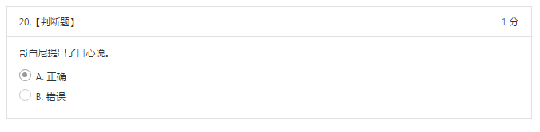
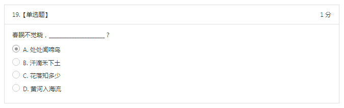
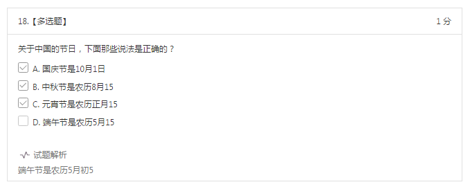
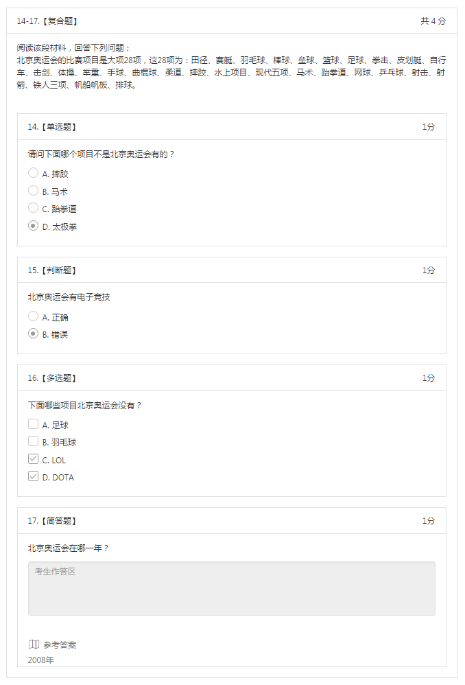
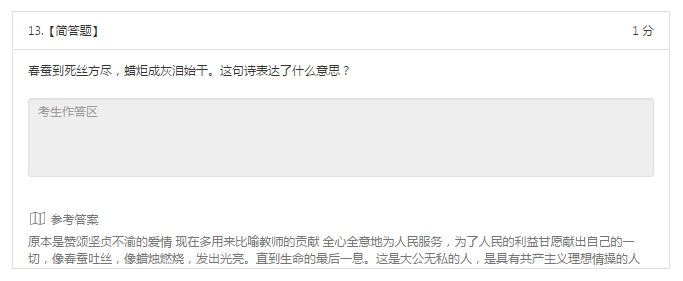
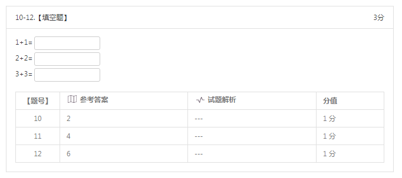
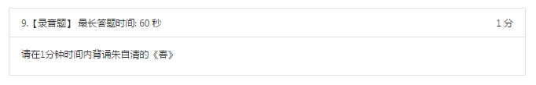
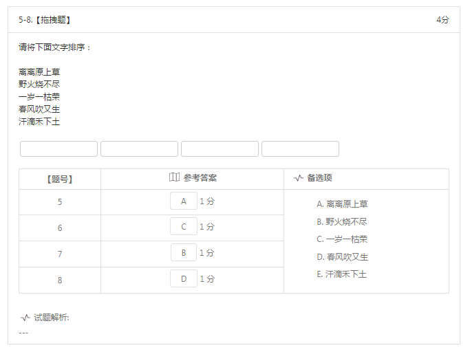

试题编辑
==========

题型展示
------------

1.判断

2.单选

3.多选

4.复合（即资料分析题）

5.简答

6.填空

7.录音题

8.拖拽题

9.完形填空题

.. image:: _static/3-9.png

- 所有类型的试题均支持上传音频和图片；

- 其中简答、填空、录音题可不设置正确答案，需要开启人工判分；若设置固定正确答案则跟答案完全一样才得分；

- 判断、单选、多选、拖拽题、完形填空题必须设置正确答案；其中拖拽题为拖拽设置正确选项；

- 复合题增加下设小题请点击“+新增子试题”并选择需要的题型，可以为：单选、多选、填空、简答。

