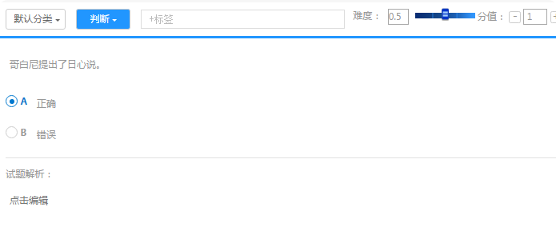

试题
==========

题型展示
------------

试卷预览界面
``````````````````

* 1、判断

.. image:: _static/3-1.png

* 2、单选


* 3、多选

.. image:: _static/3-3.png

* 4、复合（即资料分析题）


* 5、简答

.. image:: _static/3-5.png

* 6、填空


* 7、录音题


* 8、拖拽题

.. image:: _static/3-8.png

* 9、完形填空题

.. image:: _static/3-9.png

考生考试界面
``````````````

* 1、判断


* 2、单选

.. image:: _static/9-5.png

* 3、多选

.. image:: _static/9-4.png

* 4、复合（即资料分析题），点击选择小题进行答题；


* 5、简答


* 6、填空


* 7、录音题


* 8、拖拽题

将右边栏的备选项拖入左边，若托选错误可再拖回左边或拖至其他位置


* 9、完形填空题

点击空各项选择正确答案即可：


试题编辑
-------------

编辑试题须知
````````````

- 可在试卷编辑中直接添加试题，或在题库中编辑试题后导入试卷；

- 所有类型的试题均支持上传音频和图片；

- 其中简答、填空、录音题可不设置正确答案，需要开启人工判分；若设置固定正确答案则跟答案完全一样才得分；

- 判断、单选、多选、拖拽题、完形填空题必须设置正确答案；其中拖拽题为拖拽设置正确选项；

- 复合题增加下设小题可以为：单选、多选、填空、简答。

- 填空题的填空项不可随意添加到文字中间，需编辑一部分添加一个空。

试卷编辑试题
`````````````````

* 1、判断


* 2、单选


* 3、多选


* 4、复合（即资料分析题）


* 5、简答


* 6、填空


* 7、录音题


* 8、拖拽题

- 拖拽题可以为排序题，对应题或者其他匹配类型的试题；

- 选项的设置可多于填空项，不可少于填空项；

-设置正确答案时将右侧选项拖动至左侧填空项的正确位置即可；


* 9、完形填空题

即为填空选择题，每个空格项为一道小题，必须设置正确答案；


题库编辑试题
``````````````````

题库编辑试题步骤：选择该题库下的分类 → 选择题型 → 开始编辑 → 保存编辑


* 1、判断



* 2、单选


* 3、多选


* 4、复合（即资料分析题）


* 5、简答


* 6、填空


* 7、录音题


* 8、拖拽题

注:若选项设置错误，只需将右侧选项再次拖拽到左侧填空项的正确位置即可。

.. image:: _static/9-28.png

* 9、完形填空题

.. image:: _static/9-29.png