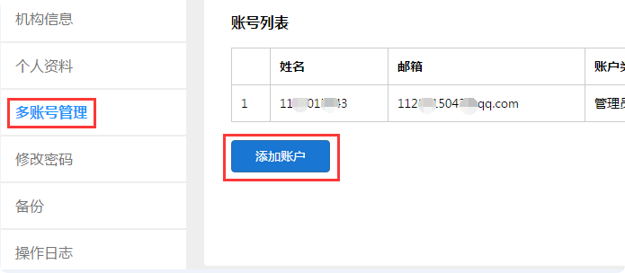
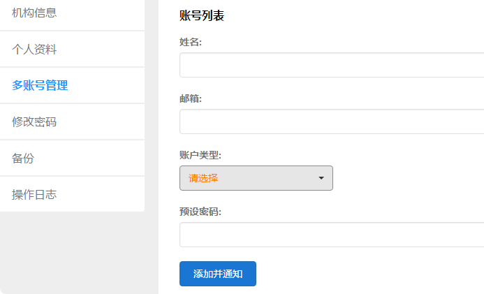

多账户管理
===========

易考主账户（在易考注册登录的账户）下可添加多个账号，即为子账户；

子账户仅可作为该主账户的分支使用，被删除后账号便不再存在；

为了方便分配主账户下的相关工作，子账户只有部分功能可使用，不同角色功能不同；

子账户可选定角色或添加自定义权限，现子账户有多个角色可选：

* 人工判分员
* 内容制作员
* 考试观察员
* 管理员
* 考试管理员

添加子账户
-------------

添加多账号的步骤如下：

* 通过右上角用户名下拉菜单进入管理中心，选择多账号管理；

* 填写帐号信息：姓名、邮箱（不可为易考已有账户）；

* 选择账户类型；

* 设置该账户的预设密码；

添加并通知后会有一封激活邮件发送到上面填写的邮箱中，激活后即可使用。





子账户各角色简介
----------------------

管理员
`````````

首先，主账户的默认角色即为管理员；

管理员拥有最高权限，可使用易考所有可见功能，可对子账户进行管理；

子账户也可添加管理员，可行使主账户所有权力。

人工判分员
````````````

作用：对考生答卷上的主观题进行判分

可操作：查看账户中的考试、阅卷判分

不可操作：修改试相关设置、查看考生信息

 `点击查看人工判分相关帮助`_

.. _点击查看人工判分相关帮助: http://docs.eztest.org/zh_CN/latest/score.html

内容制作员
```````````````

作用：制题，编辑试卷，创建题库和组卷

可操作：创建和修改删除试卷/题库；创建和修改组卷模版；组卷抽取试卷；分享试卷。

不可操作：查看和修改考试相关内容

考试管理员
`````````````

作用：安排组织考试

可操作：查看和修改试卷；查看考生信息；查看试卷；查看组卷模版。

不可操作：编辑试卷、题库和组卷

考试观察员
`````````````````

作用：查看考试中的视频监控

可操作：查看账户中的考试；进入视频监控墙查看考生视频监控；查看考生（可选择单个考生查看视频监控）

不可操作：修改考生相关设置

 `点击视频监控相关帮助`_

.. _点击视频监控相关帮助: http://docs.eztest.org/zh_CN/latest/exam.html#id15

自定义权限
----------------

若系统给出的角色不满足需求，可自行选择需要的子账户权限，自定义权限设置分别从试卷、考试、报名、题库、组卷五个模块进行设置；

部分权限需要建立在查看权限的基础上,所以勾选时会出现联动选择,详细情况参考下面的权限说明:

试卷：
```````

- 查看试卷：查看和预览试卷（如无查看权限，则整个试卷模块不可见）

- 增改试卷：修改和新建试卷（必须有查看权限）

- 分享试卷：分享试卷给其他账户

- 删除试卷：删除主账户中的试卷

考试：
`````````

- 查看考试：查看考试情况和监控考试（如无该权限，则整个考试模块不可见）

- 增改考试：创建和修改考试，包括修改考试配置和试卷设置等

- 阅卷判分：对考生进行人工判分，需考试配置开启人工判分（必须有查看考试权限）

- 删除考试：删除主账户中的考试

- 查看考生：查看考生的个人信息（必须有查看考试权限）

- 修改考生：修改考生的个人信息

- 增加考生：向考试中添加考生

- 删除考生：删除考试中的已有考生

报名：
```````

- 查看报名：查看报名（如无此权限，整个报名模块不可见）

- 管理报名：可创建报名，修改报名配置，包括对科目和考生的增删改

- 删除报名：删除整个报名

题库：
``````````

- 查看题库：查看题库和试题（如无该权限，则整个题库模块不可见）

- 管理题库：创建和修改题库，管理题库中的试题（可增删改试题）

- 删除题库：删除整个题库

组卷：
```````

- 查看模版：查看组卷模版（如无该权限，整个组卷模块不可见）

- 增改模版：创建和修改组卷模版

- 抽卷：通过已有组卷模版进行抽卷

- 删除模版：删除组卷模版