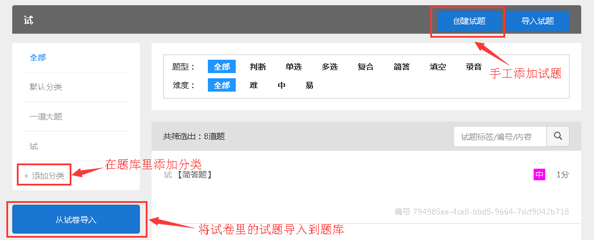
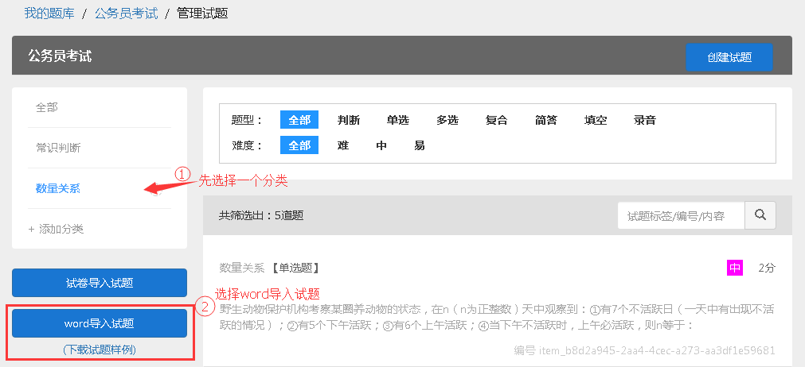

题库
=====

题库管理
---------

题库有什么用途？
````````````````````

题库可以用来储存大量试题，建议将试题按照科目、知识点等分类放在不同的题库或者分类中，方便日后组卷和制作试卷时导入试题。

1.题库里的试题可以在编辑试卷时直接添加到试卷

2.将已经制作好的试卷，可以将试卷里的试题导入到题库

3.组卷时可以从题库里随机抽取试题

如何创建题库、添加试题？
`````````````````````````

方法一：创建题库后选择从试卷导入题库，选择需要导入的试卷后，可选择默认分类或按大题名称自动分类，导入完成后点击“确认”。 

方法二：手动编辑试题加入题库，点击“创建试题”，选择题型完成编辑。 

**注：**\在“管理试题”界面，左侧栏可自主添加分类，添加分类后，将您所需的试题导入，更方便搜索。



导入试题
--------

题库里可以添加哪些类型的试题？
```````````````````````````````

1.判断

2.单选

3.多选

4.复合（即资料分析题）

5.简答

6.填空

7.录音题

所有类型的试题均支持上传音频和图片；
其中简答、填空和录音题需要人工判分；判断、单选和多选题必须设置正确答案；
复合题增加下设小题请点击“+新增子试题”并选择需要的题型。

从试卷导入题库如何分类？
`````````````````````````````

从试卷导入题库时，可以选择导入到指定分类或者按大题名称自动分类；

1.如果指定分类，则导入试卷里的所有试题放入到此指定分类；

2.按照大题名称自动分类，则按照试卷中的答题名称自动分类，如果不存在对应的分类，系统会根据大题名称自动创建分类并导入。

**注：**\按照一套试卷或一个科目所需要的试题来创建不同的题库，或者在题库中添加多个分类，这样在编辑试卷时，从题库导入试题会更加便捷哦~


Word导入试题
-------------------

步骤如下：管理试题—选择一个分类（或添加分类）—WORD导入试题—选择文档



Word导入试题到题库虽然便捷，但是对于文档里试题编辑的格式要求很是严格，下载试题样例作为参考。

**WORD导入题库注意事项：**

- 1. 多个相同题型可以设置[单选题组][多选题组][判断题组][简答题组][填空题组][录音题组]省略每道题前的题型描述。
- 2. [难度:0.7][分数:1]可省略（使用默认难度0.5，分数为1）、[答案解析]若没有可省略。
- 3. 难度等级设置数值越大越容易。原始文档有难度说明的，具体对应如下（如果原始文档没有难度，默认是中）：难：0.2；中：0.5；易：0.9。
- 4. 填空题中使用四个连续下划线表示需要填写内容的空缺，有多少空缺，后续就要有多少个[参考答案]标签。
- 5. **重要！** 请保证全文均为半角字符，具体可以用word选取全文然后转换为半角即可。
- 6. 仅支持DOCX后缀格式，DOC无法进行解析。
