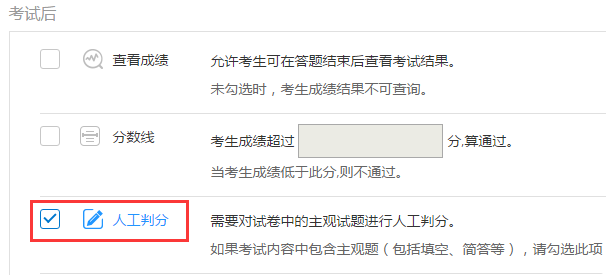
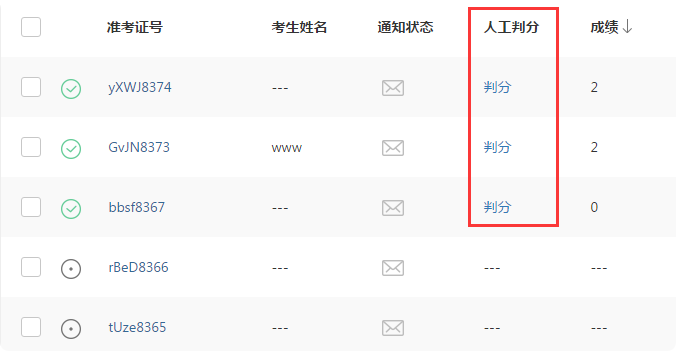
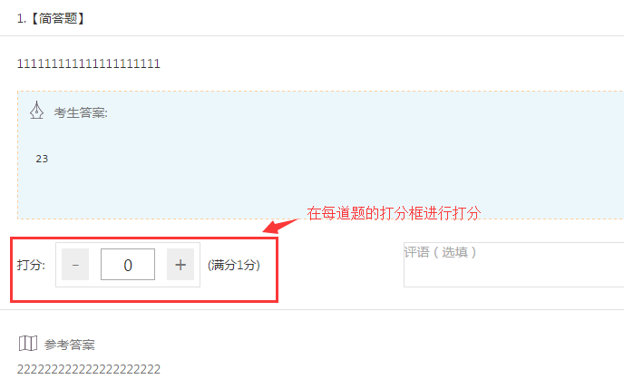
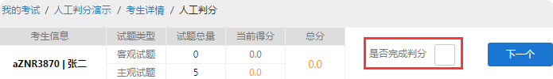
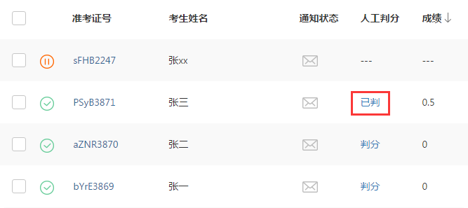
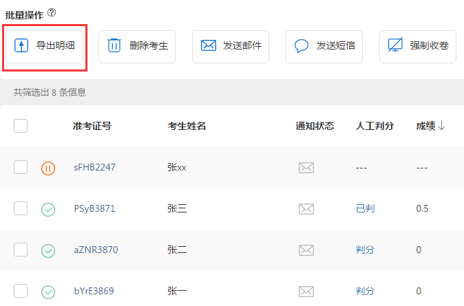
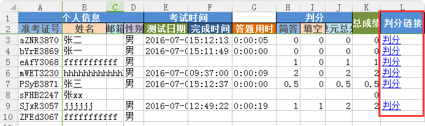

人工判分
===========

对于一些没有固定答案的试题，需要人工对考生答题情况进行判分，此时可在考试配置中勾选人工判分，即可在考生结束考试后来进行判分。

人工阅卷支持的题型有：简答题、填空题、录音题、（包括复合题中的简答、填空、录音题）。

开启人工判分的方法
``````````````````````

新建考试时在考试配置勾选人工判分；已创建的考试在考试详情页右侧“设置考试配置”里勾选人工判分；



考后人工判分如何操作？
`````````````````````````````

- 方法一：考试详情页判分

在考试详情页里，已完成的考生会有一个判分入口，如下图：



点击判分开始对该考生判分：在每道题下的打分框对该题进行打分；全部完成判分后，勾选右上方“是否完成判分”。接着点击“下一个”即可对下一个考生进行判分。





已完成判分的考生在考试详情页会显示“已判”，如图：



- 方法二：导出明细表进行判分

批量操作“导出明细”导出并下载考生明细表，在表中每个考生有一个判分链接，点击考生判分连接即可对该考生进行判分；

注：和方法一不同的是，方法二不可直接对下一个考生进行判分，需分别打开每个考生的判分链接，更适用于分配给多人判分。





如何让多人分担人工判分的工作？
````````````````````````````````````````

若一场考试结束后需要多人进行人工判分，建议您使用以下方法：

打开考试详情页，选择“导出明细”，下载考生明细表，打开该表可以看见每个考生会有一个判分连接，分发给不同的判分人即可。
