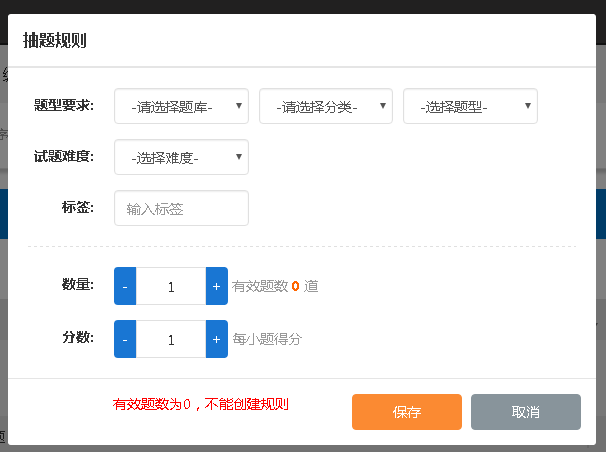
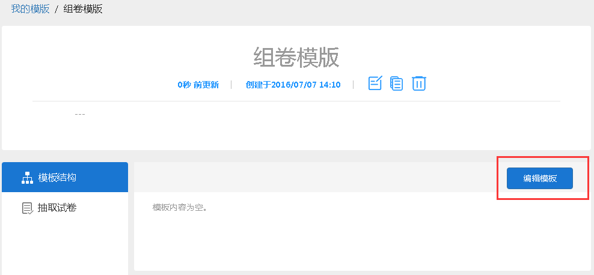
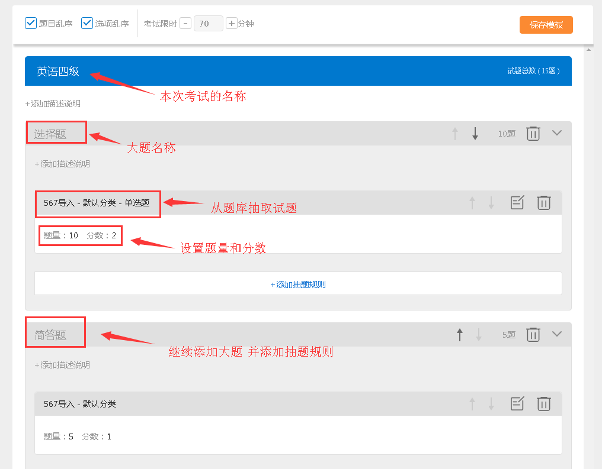

组卷
======

组卷模板
--------

什么是组卷模板，如何组卷？
``````````````````````````````

组卷模板可以实现自动从题库中抽取试题，组成试卷的任务。组卷模板跟试卷类似，但是不包含任何实际的试题，而是包含一组规则，定义了如何从题库中抽取试题。

使用组卷模板的前提是题库已经建立好，并且需要在题库里有足够可供选择的试题，题库里的试题越多，使用组卷形成的试卷的试题重复率就越低。

组卷的步骤和应用：首先需要创建组卷模版，编辑好模版结构，并添加好抽卷规则。

通过模板可以单独抽取试卷；也可以在考试中直接使用模版作为考试的试卷，以达到考生随机抽题的目的。

使用模版的方法：创建考试，添加试卷时勾选“使用模版”，选择所需要的模板，考生考试将会从该模版随机抽题组卷。

.. image:: _static/image069.png

**1.组卷模板：**\通过定义抽题规则来从题库抽取试题进行组卷。模板包含试卷的单元名称，大题名称和大题下设的小题类型和数量。

**2.抽题规则：**\可以设置题型要求，选择题库、分类、题型；选择试题难度、标签；设置该种抽题规则的数量，和每小题得分；特别注意注意所选题库里复合题所包含的小题数量和题型是否一致，否则使用模版作为试卷后，考生抽到的试卷总分和体量会不一致。



一. 设置题型要求：

1.选择所需的题库；
2.进一步选择题库里的分类；
3.最后选择你所需要的题型;

二. 选择试题难度、标签可进一步筛选所需要的试题，若不需要也可以不设置；

三. 设置抽取该类试题的数量，和每小题得分；

**特别注意：**\所选题库里复合题所包含的小题数量和题型是否一致，否则使用模版作为试卷后，考生抽到的试卷总分和体量会不一致。

.. image:: _static/image072.png

组卷的具体操作步骤
``````````````````````

**一.新建模版**\，编辑模板结构



**二. 编辑模版：**\按照需要的试卷模版来完成模版的编辑，编辑好单元名称和大题名称，在每道大题下添加抽题规则，即设置每道大题内所包含的小题类型。



抽卷
------

新建模版——完成模版编辑——抽取试卷

**注：**\抽取试卷后会放在我的试卷里。抽取到的试卷和普通试卷一样，可以进一步修改编辑。

.. image:: _static/image067.png
